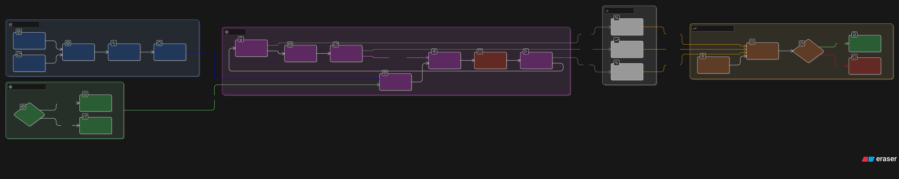

# RL_brain_trainer (V5 Active)

> 目前主線是 **V5 三層架構（L1/L2/L3）** 的 kitchen manipulation。
> V4/sim2d 保留為歷史基線，不是當前開發主戰場。

---

## V5.1 Architecture Overview



> 圖中整理了目前 V5.1 的主流程（感知/策略/執行/驗證）與 gate 決策結構，可搭配下方文檔一起看。

## V5.1 current direction（快速入口）

> 當前主軸已收斂到 **V5.1：L2 joint-space SAC + L3 deterministic safety execution**。

- V5.1 正式計劃（主文檔）：`docs/V5_1_IMPLEMENTATION_PLAN.md`
- V5.1 當前短總覽（可審核）：`docs/V5_1_STATUS_SUMMARY.md`
- V5.1 單一路線交付（ROS2+venv+SAC Torch）：`reports/V5_1_SINGLE_PATH_DELIVERY.md`
- WP1.5 Runtime parity（關鍵風險與檢查）：`docs/WP1_5_RUNTIME_PARITY_CHECKER.md`
- WP1.5 readiness / risk（關鍵風險報告）：`docs/WP1_5_READINESS_RISK_REPORT.md`
- RBT 關鍵 rerun 報告（L3）：`reports/task1_real_l3_rerun_report_2026-03-22.md`

## V5.1 開發入口（新）

### V5.1 單一路線（固定）
- 僅支援 `policy_mode=sac_torch`（不再保留 numpy SAC 與 rule fallback）。
- 固定環境：ROS2 Jazzy + `hrl_ws/.venv/bin/python`。
- 啟用環境：`source scripts/v5_1/activate_env.sh`
- 環境檢查：`scripts/v5_1/env_check.sh`


- 任務票（可直接執行）：`docs/V5_1_TASK_BOARD.md`
- 結構約定（改用 `v5_1` 命名空間）：`docs/V5_1_STRUCTURE.md`
- Pipeline bring-up + 分層記錄規範：`docs/V5_1_PIPELINE_CHECKLIST.md`

建議閱讀順序：
1. `docs/V5_1_STATUS_SUMMARY.md`
2. `docs/V5_1_IMPLEMENTATION_PLAN.md`
3. `docs/WP1_5_RUNTIME_PARITY_CHECKER.md`
4. `reports/task1_real_l3_rerun_report_2026-03-22.md`

---

## 中文（Current Truth）

## 1) 當前狀態（2026-03）
- ✅ **WP1.5 runtime hotfix 已落地並合併到 `v5`**
  - Jazzy 環境下以 **QUASI_DEDICATED** tray pose 路徑運作（非 Pose_V dedicated）。
  - `tray_pose_adapter` 已加 deterministic gate，實測可達 `fallback_ratio=0.000`。
- ✅ **controller auto bring-up 已修復**
  - 啟動後可自動 `LOAD -> CONFIGURE -> ACTIVATE`，不需手動 spawner。
- ✅ **WP2（M2-7 ~ M2-9）closeout package 已完成（軟體路徑）**
  - 已完成：training loop integration、baseline benchmark、eval harness、4-variant formal comparison、一鍵 rerun。
  - 目前證據層級是 **real path（benchmark/eval harness）**，**不是實機/HIL**。
  - 詳細說明見：`docs/WP2_IMPLEMENTATION_NOTE.md`
- ✅ 健康檢查關鍵項目可通過
  - `/controller_manager/list_controllers`：`joint_state_broadcaster` + `arm_controller` active
  - `/tray1/pose` sample PASS
  - `/v5/perception/object_pose_est` sample PASS

## 2) 架構與契約（L1 / L2 / L3）
- **L1（Intent）**：輸出任務語義，不輸出控制軌跡
  - Topic: `/v5/intent_packet`
- **L2（Policy / Skill）**：輸出 SkillCommand（中階決策）
  - Topic: `/v5/skill_command`
- **L3（Deterministic Executor + Safety）**：把 SkillCommand 轉成控制器可執行命令
  - Topic: `/arm_controller/joint_trajectory`

> 硬邊界：L2 不直接輸出 trajectory chunk/spline/joint trajectory。

## 3) 目前 canonical pipeline（sim）
Gazebo / bridge / perception：

`/world/empty/pose/info`
→ `/tray_tracking/pose_stream`
→ `tray_pose_adapter_node`
→ `/tray1/pose`
→ `object_id_publisher_node`
→ `/v5/perception/object_pose_est`

> 備註：在當前 Jazzy 環境，`Pose_V` dedicated 路徑不可用，因此使用 QUASI_DEDICATED（deterministic legacy adapter）。

## 4) WP2 方向（已拍板）
- L2/L3 頻率契約：
  - **L2 = 10–20 Hz**（中階連續策略）
  - **L3 = 100–200 Hz**（deterministic + safety shield）
- 互動策略：stale timeout + interpolation + predictive clamp + fail-safe fallback
- M1：Rule-L2 v0 baseline（U-slot flow）
- M2.1：RL action `v2` 已切為 **U-slot-first**；`gripper_cmd` 僅保留相容（deprecated），`OPEN/CLOSE` 的 gripper-only legacy 寫法在 `v2` 會被拒絕（`v1` 不變）

## 5) 術語定義（避免誤解）
- **real path**：指 repo 內 benchmark/eval harness 的真實程式路徑執行（非 placeholder/simulated rows）。
- **real robot runtime**：指實體機器人控制器/硬體/HIL 的實機執行。
- 本 repo 目前 WP2 M2-9 證據屬於前者（real path），尚未宣稱後者（real robot runtime）。

## 6) 常用命令
### 啟動場景（canonical）
```bash
cd /home/jerry/.openclaw/workspace/repos/personal/RL_brain_trainer
source /opt/ros/jazzy/setup.bash
scripts/v5/launch_kitchen_scene.sh --mode headless
```

GUI（需要桌面環境）
```bash
cd /home/jerry/.openclaw/workspace/repos/personal/RL_brain_trainer
source /opt/ros/jazzy/setup.bash
scripts/v5/launch_kitchen_scene.sh --mode gui
```

### 快速健康檢查
```bash
source /opt/ros/jazzy/setup.bash
source /home/jerry/.openclaw/workspace/repos/personal/RL_brain_trainer/external/kitchen_scene/src/install/setup.bash

ros2 service call /controller_manager/list_controllers controller_manager_msgs/srv/ListControllers "{}"
ros2 topic echo /tray1/pose --qos-reliability best_effort --once
ros2 topic echo /v5/perception/object_pose_est --qos-reliability best_effort --once
```

---

## English (Brief)

### Current active line
- V5 kitchen manipulation is the active development line.
- WP1.5 runtime fixes are merged on `v5`.
- In current ROS 2 Jazzy environment, Pose_V dedicated tray path is unavailable; system runs in **QUASI_DEDICATED** mode with deterministic legacy adapter and validated healthy topic flow.

### Core contract
- L1 intent: `/v5/intent_packet`
- L2 policy skill command: `/v5/skill_command`
- L3 deterministic execution: `/arm_controller/joint_trajectory`

### Health checks expected
- `joint_state_broadcaster` + `arm_controller` active
- `/tray1/pose` sample available
- `/v5/perception/object_pose_est` sample available (`tray1`)

For detailed implementation milestones and constraints, see:
- `docs/WP2_IMPLEMENTATION_NOTE.md` (M2-7~M2-9 closeout, terminology: real path vs real robot runtime)
- `docs/V5_KITCHEN_IMPLEMENTATION_PLAN.md`
- `docs/WP1_5_RUNTIME_PARITY_CHECKER.md`
- `docs/V5_EXPERIMENT_LOG.md`
