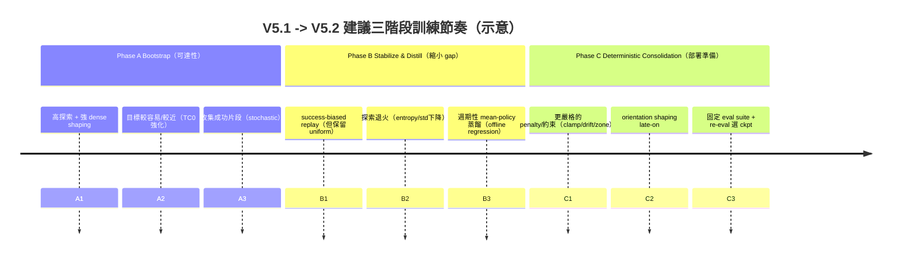

# 機器手臂 SAC 訓練的 Reward Shaping 與 Curriculum 設計：縮小 Stochastic Rollout 與 Deterministic Mean Policy 落差的分階段方案

## Executive summary
你現在遇到的核心矛盾是：**SAC 的訓練目標天然包含隨機性（熵）**，但你在部署與評估時通常會把隨機性拿掉、改用 **mean action 的 deterministic policy**，因此很容易出現「訓練時看起來會成功、deterministic 卻不會」的 performance gap。citeturn32view0turn19view0  
要讓訓練成長更「絲滑」，優先順序建議是：先把 **eval/ckpt protocol 做到可重現且低噪聲**（否則你選到的 best checkpoint 會漂），再用 **分階段 curriculum + reward annealing** 讓能力逐步穩定，最後用 **success-biased replay + mean-policy distillation（或 advantage-weighted BC）** 把「靠抽樣才成功」的能力穩定搬到 mean policy。citeturn30view0turn21view0turn22view0turn11view0turn3view3  
另外，你的 executor/runtime 有 clamp/projection 這類「動作後處理」，它會讓 actor 的輸出與真正執行動作不同；若訓練/蒸餾時沒有把這個差異當成一級公民處理，deterministic gap 會更明顯。citeturn30view1  
本報告最後提供一套**至少三階段**的可落地訓練流程、reward shaping 建議、測試矩陣、以及你每次 periodic eval 應該額外採集的診斷資料與工程 patch list（含優先級/難度），並給一份可直接貼進實驗紀錄的「實驗計畫」。citeturn30view0turn26view3  

## 你的情境與必須顯式考慮的維度
### 你目前系統的關鍵結構
你描述的 V5.1 訓練架構可概括為：觀測包含關節狀態、末端執行器到目標的相對誤差、以及前一步 action；policy 為 SAC（stochastic actor）；action 會經 executor/runtime（含 clamp/projection）；transition 進 replay 後做 online actor-critic 更新；reward 用分層距離盆地與一系列 bonus/penalty。這些設計在「能學到接近/偶爾成功」上已經有效，但現在瓶頸轉移到 **(a) det eval 不一致、(b) mean policy 不穩定承接 stochastic 能力、(c) checkpoint selection 噪聲大**。citeturn30view0turn21view0  

另外，從你提供的程式片段可以看出你已經把一些重要的控制旋鈕與資料記錄做出來：例如 `action_scale`、`exploration_std_scale`、`bc_lambda`（以及 BC 的條件設計）、actor update delay 等。fileciteturn0file2L40-L79 replay buffer 也已經保存 raw/exec action 以及 clamp/projection/rejected 的訊號，這對後續做「成功片段蒸餾」與「gap 診斷」非常關鍵。fileciteturn0file3L38-L66 reward 設計也呈現「距離進度 + shell/dwell + drift/zone exit + action regularization」的分解式結構。fileciteturn0file1L9-L34  

### 必須列入設計與實驗的維度清單
下表把你要求的維度整理成「會造成什麼失敗型態」與「如何量測/控制」；這也是後面測試矩陣的索引。

| 維度 | 典型失敗型態（對 det gap 特別敏感） | 建議控制/記錄 |
|---|---|---|
| Observation space 特性（關節狀態、相對誤差、prev action） | 部分可觀測/延遲導致 policy 依賴 stochasticity 才能「碰巧修正」；mean 變成「平均後的錯誤動作」 | 記錄「成功轉折點附近」的 observation 分佈；對 good transitions 做特徵統計（均值/方差）citeturn26view3 |
| Action space 特性（連續、尺度、維度） | 均值動作過小→靠噪聲才推得動；或均值動作剛好落在 clamp 邊界→被投影後變成壞動作 | 系統性掃 `action_scale`；在 eval 中計算 clamp/projection rate 與 `||a_raw-a_exec||`citeturn30view1 |
| Executor/runtime 對 action 的影響（clamp/projection） | mean action 進入「投影的死區」或反覆被裁切導致零梯度/學習效率差；stochastic 偶爾抽到可行方向才成功 | 把 executed action 視為一級資料：以 exec action 訓練 critic、蒸餾 student；記錄 clamp/projection triggerciteturn30view1turn0file3L38-L66 |
| Exploration noise schedule（含 `exploration_std_scale`） | 訓練靠高噪聲成功，但 mean policy 沒有對應能力→gap 擴大 | 設計「熵/噪聲退火」與「成功後降噪」規則；同時跑 det 與多噪聲 evalciteturn32view0turn5view0 |
| BC / 蒸餾方法（aux loss vs separate phase） | BC 太強→學到保守平均；太弱→mean 不會；若選錯資料→把壞行為蒸餾進 mean | 用 advantage-weighted / success-weighted 的資料挑選；區分「actor 訓練中小權重」與「額外 distill job」citeturn11view0turn3view3turn22view0 |
| Replay 篩選條件（success-biased, shell-biased, PER） | 過度偏好成功片段→過擬合；或成功太稀少→學不到；PER 可能不穩、控制任務不一定贏 uniform | 用「混合採樣」：高品質子集 + uniform；同時記錄分佈漂移；必要時用 episode-level 成功重加權citeturn0search15turn22view0 |
| Checkpoint / eval protocol（suite 固定、best-eval vs re-eval） | periodic eval 與 post-train eval 不一致、導致 best checkpoint 漂移 | 固定 eval suite 與 random seeds；採用 re-eval/leaderboard；記錄 eval 條件的 metadata citeturn30view0turn26view3 |
| Curriculum schedule（target curriculum / environment shifts） | curriculum 卡在 TC0；或跨難度時 policy 退化；成功只在特定 target 分佈 | 用 success-threshold 觸發升級；或用自動 waypoint/環境 shift；每階段明確 KPI 進階citeturn7view0turn9view0turn8search16 |
| Reward components（distance progress、shell、dwell、drift、orientation shaping） | step/basin 型 reward 需要噪聲跨門檻；dwell 設計使 mean 容易「站不住」；orientation shaping 太早→學不動 | 以「reward annealing」讓 dense→sparse；把 penalty/constraint 在後期加重；orientation shaping 延後再上citeturn31search14turn31search0turn22view0 |

## 近五年研究與實作證據：哪些方法最貼合你的 gap
這一節把你指定要比較的方法，按照「對 deterministic gap 的直接緩解能力」排序，並盡量引用原始論文/官方實作。

### 為什麼 SAC 常出現「訓練 stochastic 強、測試 mean 弱」
在常見 SAC 實作中，**訓練時從策略分佈抽樣**，而「測試/評估」通常會**移除隨機性、改用 mean action**來看 exploitation 表現；文件明確指出這是常規做法，且通常會提升表現，但這個假設在某些任務（需要跨門檻、或 action 經投影/裁切）會失效，於是產生你觀察到的 gap。citeturn32view0turn30view1  
更近期的理論工作也直接點名「實務上用 stochastic PG 學到的 policy，最後部署 deterministic 版本」這個落差，並討論如何調 exploration level 來兼顧 sample efficiency 與 deterministic 部署表現。citeturn19view0  

### 分階段 curriculum：把「要跨過的門檻」拆成多個可學小步
對目標到達/操控任務，最常見的 curriculum 來源有三類：

第一類是「**中繼目標/waypoint curriculum**」。例如 C-Planning 把遠距目標拆成一串 waypoint，訓練時用搜尋產生 waypoint curriculum、測試時不需要再規劃，核心效果是提升資料品質與長視野可達性。citeturn7view0 這類方法的精神非常適合你現在的「shell/inner/dwell」：你已經在 reward 上做了 waypoint 化（進 outer/inner shell、dwell），但如果門檻是硬的（step bonus），就容易變成「靠噪聲跨門檻」。

第二類是「**環境/任務參數 shift**」。COHER 把 curriculum 建立在「環境 shift + success threshold」上：當成功率過門檻就把任務變難，並且把 agent 與任務共同演化（co-adapting）。COHER 的官方程式庫也提供了可重現流程與 DOI。citeturn9view0 你的 target curriculum 多數停留在 TC0，這暗示「進階條件」或「訓練訊號」可能不夠穩定（或 eval 噪聲讓你不敢升級），這正是 COHER 類方法試圖解的問題。

第三類是「**hindsight/goal-relabel 類隱式 curriculum**」。HER 把失敗軌跡 relabel 成成功於其他目標，常被視為一種 implicit curriculum。citeturn8search16 HEM（Hindsight Expectation Maximization）則從 probabilistic / EM 的角度解釋 hindsight，並把 M-step 變成類 supervised 更新以提升穩定性，且在多個 goal-conditioned benchmark 上優於 model-free baselines。citeturn5view1 這對你很關鍵：你想把「偶爾成功片段」穩定化，本質上就是把 RL 更新的一部分轉成更可控的 supervised/weighted regression 更新。

### Reward annealing 與 Dense→Sparse：讓 shaping 不再「卡門檻」
你目前 reward 已經是高度 shaping，但 deterministic gap 常見來源之一是：**成功需要跨某個狹窄區域/門檻**，stochastic 能靠抽樣跨過，mean 卻常在門外盤旋。把 step bonus 改成「連續可微的盆地」，並且在訓練過程中**逐步退火（anneal）**，是常見的解法。Dense2Sparse（2020）就是一個典型框架：先用 dense reward 快速引導，再逐步轉向 sparse objective；論文回報在機器人操控情境下比單純 dense 或 sparse 更有效。citeturn31search14  
若你擔心 shaping 改變最優策略，可以用 Potential-Based Reward Shaping（PBRS）的理論保證：Ng 等人證明用 potential 差分形式加入 shaping reward 可保持（近）最優策略不變。citeturn31search0 近年也有把 PBRS 擴展到更一般（含 intrinsic motivation）設定並提供保最優性的工作。citeturn31search12turn31search2  

### Success-based replay / self-imitation：把「成功片段」變成可學信號
你現在最大的資產其實是：**train rollout 已經出現 success episode**。把它「制度化」是關鍵。SACR2 就非常貼近你的需求：它對 demonstrations 與成功 episode 的 transitions 給予 reward bonus，並把成功 episode 重新標記成類 demonstrations，實驗還特別聚焦在「機器手臂 3D reaching」並回報有效改善。citeturn22view0  
這個思路對你最重要的啟示不是「一定要用 demo」，而是：**成功 episode 的回放本身就是一種自我示範**；只要你能穩定收集成功、並在 replay 中提高其學習貢獻，就能更快把能力固化。

### Deterministic distillation：把「抽樣的好動作」壓回 mean policy
要縮小 stochastic→mean gap，最直接做法是：**額外訓練一個 deterministic student（或同一個 actor 的 mean head）去回歸 teacher 的好動作**。經典 policy distillation 早已存在（雖然超過五年），但近年又重新被用在「穩定部署、改善泛化、壓縮延遲」等目標上。citeturn29search1turn29search21turn29search6  
在你的情境，最關鍵的 distill 設計點是「資料挑選」：你不能把整個 replay 的 action 都拿來回歸，否則 mean 只會學到 **「平均化的無效行為」**。因此 distill 必須是 **success-biased / advantage-weighted**。

這正好能借用 AWAC 與 IQL 的 policy extraction 思想：兩者都用「類 BC/ML 更新」去擬合更好的行為，並用 advantage 權重來避免盲目模仿。citeturn11view0turn3view3 你不一定要把整個演算法換成 AWAC/IQL，但你可以把它們當作「蒸餾 loss 的設計參考」。

### Entropy/variance 控制：讓 stochastic policy 自己「變得可 deterministic」
如果你的 gap 來源是「策略在成功區域仍然保有過高的方差」，那你應該讓 **成功後的方差下降**，而不是維持整場訓練同一套 target entropy。SAC 的熵正則本來就控制探索/利用折衷。citeturn32view0  
TES-SAC（雖然做在 discrete）提供了很直觀且有實驗支撐的規則：當策略熵穩定貼近目標後，逐步降低 target entropy，讓策略在後期更 deterministic。citeturn5view0turn29search14 你可以把它轉譯成 continuous 版本：用 `exploration_std_scale` 或 target entropy schedule，在成功率達到某門檻時下降。

### 低噪聲 eval 診斷與 checkpoint selection：你現在最缺的一塊「科學實驗控制」
你已經發現 periodic deterministic eval 與 post-train deterministic eval 不一致，這通常不是「模型忽然壞掉」那麼簡單，而是 eval protocol/條件不一致造成的估計噪聲與 selection bias。ChainerRL 的論文把 evaluation protocol 的關鍵細節寫得非常清楚（evaluation frequency、phase length、policy、best-eval vs re-eval 等），並指出這些細節會顯著影響結果、也會影響你能「挑到哪個 best checkpoint」。citeturn30view0  
此外，強調 evaluation budget 與 offline/online 評估不確定性的研究也指出：評估 episodes 太少會讓表現估計方差太大，造成錯誤的模型選擇。citeturn21view0turn26view3  
因此在你做任何 reward/curriculum 大改前，**先把 eval suite 固定、重跑一致、減少噪聲**，會直接提升你能保留下真正有效 policy 的機率。

## 建議的分階段訓練方法與 reward shaping 策略
下面提供一套「至少三階段」的流程，特別以你的 SAC + executor clamp/projection + shell/dwell shaping + det gap 為核心。未指定的超參數會標註「未指定」。

### 整體分階段概念
這套流程的哲學是：  
第一階段先把「可達性」做出來（允許 stochastic 幫忙，不急著追 deterministic）。  
第二階段開始把成功片段「制度化」：成功偏好 replay + 降噪 + 蒸餾 mean。  
第三階段做 deterministic consolidation：把 mean policy 變成你真正要部署的東西，並確保 eval/ckpt 用同一套 protocol。



### Phase A：Bootstrap 可達性（stochastic 允許強，目標是「進 shell 並靠近」）
**訓練目標（KPI）**  
KPI-A1：outer shell hit rate 上升且穩定（例如 >X% 持續 N 次 eval；X、N 未指定）。  
KPI-A2：inner shell 進入率開始出現（哪怕 dwell 還不穩）。  
KPI-A3：train stochastic rollout 的 success episode 出現並不再是孤例（你目前已達成）。  

**Reward shaping 建議**  
1) 把最主要 learning signal 聚焦在「距離進度」的 potential-based 形式：`progress ≈ Φ(s') - Φ(s)`（例如 Φ=-distance），這類 shaping 在理論上可保持最優策略不變。citeturn31search0  
2) outer/inner shell bonus 在 Phase A 可以保留，但建議把「硬 step」改成「平滑盆地」，例如用 sigmoid/Huber 讓進入門檻不需要靠抽樣跨過（實作細節未指定）。這是為了減少日後 deterministic gap。citeturn31search14  
3) dwell bonus 在 Phase A 建議先降低權重或降低 dwell 需求（未指定），避免策略尚未學會「穩定靠近」就被 dwell 牽制，導致靠噪聲才偶爾站住。  

**Exploration schedule 建議**  
在 Phase A 允許維持你目前效果好的高探索基線（你提到 10 step + action_scale 0.08 + exploration_std_scale 0.60 最佳），但同時開始記錄成功附近的 `log_std`，為 Phase B 的退火做準備。SAC 的熵正則就是探索控制旋鈕。citeturn32view0turn24view0  

**BC/蒸餾策略**  
Phase A 僅建議「弱 BC auxiliary」或不開（你觀察到 BC-only 在關掉 exploration schedule 後 deterministic 指標回到未加 BC 水準，代表目前 BC 不是核心解）。若要開，建議只對**高品質轉移**（下面定義）開，且權重很低（未指定）。citeturn11view0turn22view0  

**Eval suite 設定**  
Phase A 的 periodic eval 就算仍是 deterministic，也必須固定條件；否則你會在 Phase B 之前就開始被「選 ckpt 噪聲」綁架。關於 evaluation protocol 的重要性與 best-eval/re-eval 差異，文獻已強調會顯著改變結果。citeturn30view0turn26view3  

### Phase B：Stabilize & Distill（重點：縮小 stochastic→mean gap）
這是你現在最該投入的階段：透過「成功偏好 replay + 降噪 + mean 蒸餾」把能力轉成 deterministic。

**訓練目標（KPI）**  
KPI-B1：`det_success`（mean policy）開始非零，且跟 `train_success` 的差距縮小。  
KPI-B2：成功時的 `||a_sample-a_mean||` 明顯下降（表示成功不再依賴大噪聲偏移）。  
KPI-B3：final_minus_min（你用來抓「接近後又飄走」的指標）下降，regression_rate 下降。  

**核心方法一：success-biased replay（混合採樣，避免過擬合）**  
你可以把 replay 分成兩個子緩衝：  
- `D_good`：高品質轉移（成功、或 inner shell dwell、或距離進度顯著、且 clamp/projection 少）  
- `D_all`：一般 replay（現有）  

每次更新用 mixture：`p*batch from D_good` + `(1-p)*batch from D_all`。這等價於把 SACR2 的「成功 episode 當示範」精神搬到你的 shaping 版本。citeturn22view0  
同時要小心「只抽好資料」可能造成 overfitting；PER 在控制任務不一定穩贏 uniform 的經驗研究也提醒過度偏差的 replay 可能沒有一致收益。citeturn0search15  

**核心方法二：entropy/variance 退火（成功後降噪）**  
你可以用兩種做法（擇一或並用）：  
- **調 target entropy / α**：仿照 TES-SAC 的思路，當 policy entropy 進入穩定區後逐步下降，讓策略後期更 deterministic。citeturn5view0turn29search14  
- **調 `exploration_std_scale`**：更工程化，對你現有碼最簡單。建議把退火與 KPI 綁定：例如當 `inner_shell_hit_rate` 或 `train_success` 達阈值，就把 `exploration_std_scale` 乘上一個 <1 的因子（未指定）。核心原理仍是「探索程度要為 deterministic 部署服務」。citeturn19view0turn32view0  

**核心方法三：Mean-policy distillation（offline regression，把好動作壓回 mean）**  
這是縮小 gap 最直接的一槍。設計要點：  
1) Teacher action 用什麼？  
   - 若你的 runtime/clamp 影響很大，**優先回歸 executed action**（或回歸「經 executor proxy 後」的 action），因為那才是環境真正看見的動作。動作投影/裁切在文獻中會引發「zero-gradient」與學習效率問題，將約束與 policy update 解耦（用 regression 角度）是一種方向。citeturn30view1turn0file3L38-L66  
2) 資料如何加權？  
   - 參考 AWAC/IQL：用 advantage 權重做「偏好更好動作」的 BC/回歸，而不是平均模仿。citeturn11view0turn3view3  
3) 蒸餾頻率  
   - 建議先用「每 K 個 gradient step 做一次蒸餾 mini-epoch」（K 未指定），或「每次 periodic eval 後對 best candidates 做一段 distill」。  

你可以把它做成「額外 job」而不是塞進 actor update（因為你希望它對 mean 明確施壓，同時不破壞 SAC 主訓練的穩定性）。citeturn29search21turn26view3  

**Reward 權重建議（Phase B 的方向性調整）**  
- **降低 shell step 感**：把 outer/inner shell bonus 逐步退火（例如權重下降或函數變得更平滑），避免策略只學會「撞門檻」而不是「穩定停留」。citeturn31search14  
- **提升 dwell 的「可學性」**：dwell 不要是純二元，改成「在 inner 區域的停留時間/速度的連續函數」，讓 mean 不需要靠隨機擾動才能偶然滿足。  
- **drift penalty 在 Phase B 逐步上升**：因為你現在觀察到接近後仍可能飄走（final_minus_min / regression）。但要注意 drift 若太早太強，會讓策略變得過於保守。  

### Phase C：Deterministic consolidation（把 mean policy 當成最終產品）
這一階段的目標是「部署品質」，要讓 mean policy 在你真正關心的 target 分佈上穩定成功。

**訓練目標（KPI）**  
KPI-C1：deterministic success rate 在固定 eval suite 上穩定提升並可重現（跨 seed）。  
KPI-C2：`det_success` 與 `stochastic_eval_success` 差距小（或 mean 更好）。  
KPI-C3：clamp/projection rate 在 det eval 顯著下降。  

**Reward shaping：引入 orientation shaping（late-on）**  
你列出的 reward component 包含 orientation shaping；這類 shaping 建議晚點上：  
- Phase A/B 先讓位置 reaching 穩定  
- Phase C 才把 orientation 誤差納入（例如以 cosine distance / quaternion distance 的平滑項）  

如果擔心 shaping 改變最優策略，可用 PBRS 形式包裝 orientation potential（概念上），或至少確保 orientation 權重是 annealing 上升而非一開始就很大。citeturn31search0turn31search12  

**探索策略：評估與部署一致**
Phase C 的訓練可以仍保留少量 stochastic（避免局部最優），但你必須明確把「要部署的 deterministic mean」放進目標函數與模型選擇：  
- 例如把 checkpoint 打分改成 `Score = det_success - λ * (det_vs_stoch_gap)`  
- 或把 distill job 變成 Phase C 的主要更新來源之一（未指定）。citeturn19view0turn32view0  

**Eval suite 與 checkpoint 選擇：從 best-eval 走向 re-eval/leaderboard**
你已經遇到「periodic det eval 高，但 best ckpt 的 post-train det eval 仍 0」這種衝突，這非常像 evaluation protocol / variance 造成的 selection bias。ChainerRL 明確把 best-eval 與 re-eval 區分出來，並指出 evaluation phase 長度與頻率會影響你能挑到的 best model，以及估計方差。citeturn30view0  
因此 Phase C 建議採：  
- 固定 eval suite（同一組 targets + seeds）  
- Periodic eval 只負責產生候選 ckpt  
- 候選 ckpt 再做 **re-eval（更大樣本數）** 才能上 leaderboard  
- 最後用 leaderboard 的結果當 best checkpoint（deterministic-only）。citeturn21view0turn26view3  

## 可執行的測試矩陣、診斷指標、可視化與示例 pseudo-code
### Eval 與測試矩陣必備的「固定條件」
在你改任何學習算法之前，先把以下條件固定，否則所有 ablation 會被噪聲淹沒：  
- 固定 `eval_suite`：目標點集合（或環境 seed 集合）固定，並在 periodic 與 post-train 共用。citeturn30view0  
- 固定 `eval_policy`：明確定義三種 evaluation：  
  1) `det(mean)`：純 mean action（你關心的部署）citeturn32view0  
  2) `stoch(scale=1.0)`：照訓練抽樣（診斷上限）  
  3) `stoch(scale=0.2)`：低噪聲抽樣（診斷「是否只靠大噪聲」）  
- 固定 episode 數（`eval_suite_size`）：至少大到讓 success rate 的估計方差不至於支配模型選擇（確切數字未指定，但你目前的現象高度暗示太小）。citeturn21view0turn26view3  

### 建議實驗矩陣（可直接照表跑）
下表是以「最少但信息量最大」為原則的可執行矩陣；每一列都應該同時報告：det success、stoch success、gap、以及 regression 指標。

| 實驗組 | action_scale | exploration_std_scale | BC_strength（λ_bc） | distill_frequency | eval_suite_size | checkpoint_score_rule | 預期主要觀察 |
|---|---:|---|---:|---|---:|---|---|
| Baseline（你目前最佳） | 0.08 | 固定 0.60 | 0 或 very low | none | 小→大（兩種） | 現行 best-eval | 建立基準：gap、noise、eval 不一致是否仍存在 |
| E1 固定 eval suite + re-eval | 0.08 | 0.60 | 同 baseline | none | 大 | re-eval leaderboard | **先驗證：best ckpt 選擇是否變穩**citeturn30view0turn21view0 |
| E2 探索退火（成功觸發） | 0.08 | 0.60→0.30（規則） | 0 | none | 大 | re-eval leaderboard | det_success 應上升、gap 應縮小citeturn5view0turn19view0 |
| E3 success-biased replay（混合） | 0.08 | 0.60 | 0 | none | 大 | re-eval leaderboard | train_success 可能更快；若過擬合，stoch 上升但 det 不升citeturn22view0turn0search15 |
| E4 distill-only（在 E3 上加） | 0.08 | 退火或固定 | 0 | 每 N step | 大 | det-only leaderboard | **最可能直接抬升 det_success**（若資料挑選正確）citeturn11view0turn3view3turn30view1 |
| E5 BC auxiliary vs separate distill | 0.08 | 同 E4 | 低/中 | none 或 distill | 大 | same | 比較：aux BC 可能影響 SAC 更新；separate distill 更可控citeturn11view0turn21view1 |
| E6 action_scale 掃描（小幅） | 0.06/0.08/0.10 | 退火 | 選最佳方案 | 選最佳方案 | 大 | same | 找「mean action 是否太小/太大」的甜蜜點（並觀察 clamp rate）citeturn30view1 |

**建議優先順序**：E1 → E2 → E4（或 E3+E4）→ E6 → E5。理由是：若 eval/ckpt 還在漂，你會無法判斷 reward/curriculum 變更是否真的有效。citeturn30view0turn26view3  

### 每次 periodic eval 必收的診斷指標
除了你已有的 success/return，建議加以下指標，直接對準你的 gap：

- **det_success vs stoch_success**（同一 eval suite、不同 action 生成方式）。citeturn32view0  
- **‖a_sample − a_mean‖**：對同一 state，抽 N 次 action，計平均偏移量；如果成功所需偏移很大，代表目前能力「不在 mean」上。citeturn19view0  
- **Q gap**：  
  - `Q_mean = min(Q1,Q2)(s, a_mean)`  
  - `Q_samp = average_k min(Q1,Q2)(s, a_k)`  
  - 記錄 `Q_samp - Q_mean` 在 good states 上的分佈（若長期為正，代表 mean 不是 critic 認為的好動作）。citeturn32view0  
- **log_std on good transitions**：在 `D_good` 上統計 actor 的 log_std（若偏高，說明還沒收斂到可 deterministic）。citeturn32view0turn5view0  
- **clamp/projection rate（eval 專用）**：`P(clamp_triggered)`、`P(projection_triggered)`、以及 `E[||a_raw-a_exec||]`。動作投影/裁切可能造成學習停滯或行為不一致。citeturn30view1turn0file3L38-L66  
- **regression_rate**：進 inner shell 後又離開、或 final_minus_min 過大（你已有概念）。  
- **bc_good_fraction**：若你做 distill/BC，記錄每次蒸餾用到的高品質資料比例、以及其成功標籤占比（避免「蒸餾其實在學壞資料」）。citeturn11view0turn3view3  

### 可視化圖表建議
你可以用最少的圖看懂系統：

1) **Learning curves：三條 success**  
   - `train_stoch_success`（訓練 rollout）  
   - `eval_stoch_success(scale=1.0)`  
   - `eval_det_success(mean)`  

2) **Gap dashboard**  
   - `gap = eval_stoch_success - eval_det_success`  
   - `E[||a_sample-a_mean||]`（good states）  
   - `E[log_std]`（good states）  
   - `clamp/projection rate`（eval）  

3) **Checkpoint stability**  
   - periodic best-eval 分數 vs re-eval 分數（同一 ckpt）  
   - leaderboard 前 K 的 re-eval success rate 分佈（置信區間/標準差）citeturn30view0turn21view0turn26view3  

### Pipeline 流程圖（含 replay 篩選與 distill job）
```mermaid
flowchart TD
    A[Rollout: stochastic policy] --> B[Executor/Runtime: clamp/projection]
    B --> C[Store transition in replay: (s,a_raw,a_exec,r,s')]
    C --> D{Quality filter?}
    D -->|yes| E[D_good: success/inner/dwell/progress]
    D -->|no| F[D_all]
    E --> G[Actor-Critic update (SAC)]
    F --> G
    E --> H[Periodic distillation job]
    H --> I[Student/Mean regression to a_exec (weighted)]
    I --> J[Update mean policy (or separate deterministic net)]
    J --> K[Eval suite: det(mean), stoch(1.0), stoch(0.2)]
    K --> L[Checkpoint leaderboard (re-eval)]
```

### Pseudo-code：從 replay 篩 high-quality transitions 並做 mean-policy distillation
下面是「可以直接照著塞進你現有框架」的概念性 pseudo-code（細節依你的資料結構調整，未指定）。

```python
# PSEUDO-CODE (not runnable as-is)

def transition_quality(t):
    # t has: dpos, in_outer, in_inner, dwell_steps, drift, success, clamp, proj, a_raw, a_exec
    q = 0.0
    q += 5.0 * t.success
    q += 1.0 * t.in_inner
    q += 0.3 * t.in_outer
    q += 0.1 * clip(t.dpos_progress, -pmax, pmax)   # potential-based-ish
    q -= 0.5 * t.drift
    q -= 0.2 * (t.clamp or t.proj)
    q -= 0.1 * norm(t.a_raw - t.a_exec)
    return q

def build_good_set(replay, top_frac=0.05):
    scored = [(transition_quality(t), t) for t in replay.sample_many(M)]
    scored.sort(key=lambda x: x[0], reverse=True)
    K = int(len(scored) * top_frac)
    return [t for _, t in scored[:K]]

def distill_mean_policy(actor_mean, replay_good, critic=None, beta_awac=None):
    # actor_mean outputs mu(s); we regress to executed action a_exec
    for batch in iterate_minibatches(replay_good, bs):
        s = batch.s
        a_tgt = batch.a_exec  # prefer executed action
        w = ones(bs)

        # optional: advantage-weighted BC (AWAC/IQL-style)
        if critic is not None and beta_awac is not None:
            a_cur = actor_mean.mu(s)
            adv = critic.Q(s, a_tgt) - critic.Q(s, a_cur)
            w = exp(beta_awac * clip(adv, adv_min, adv_max))

        loss = mean(w * mse(actor_mean.mu(s), a_tgt))
        actor_mean.optimize(loss)
```

## 工程改動清單與實驗計畫
### Patch list（先做哪些工程改動）
以下每項都對準你目前「評估不一致、checkpoint 選擇不可靠、mean policy gap」的宏觀問題。

| Patch | 目的 | 內容要點 | 優先級 | 難度 |
|---|---|---|---|---|
| 固定 eval suite（suite freeze） | 消除 periodic vs post-train 不一致 | 固定 targets/seed；det/stoch eval 共用；把 suite ID 寫入 ckpt metadata | 最高 | 低 |
| deterministic-only checkpoint leaderboard + re-eval | 讓 best ckpt 真正對齊部署目標 | periodic eval 產生候選；re-eval 用更大樣本數；只看 det(mean) 排名 | 最高 | 中 |
| checkpoint metadata freeze | 防止「同名 ckpt 不同條件」 | 保存：環境版本、executor 設定、reward config、action_scale、std_scale、TC 狀態、eval suite hash | 高 | 中 |
| diagnostic logging 增補 | 能定位 gap 來源 | 收集：det vs stoch、‖a_sample-a_mean‖、Q gap、log_std(good)、clamp/proj rate、bc_good_fraction | 高 | 中 |
| 新增 distillation job（offline regression） | 直接把成功能力搬到 mean | 從 replay 篩 `D_good`；回歸 a_exec；可加 advantage weight；週期或每 N step 執行 | 高 | 中~高 |
| success-biased replay（混合採樣） | 提高成功訊號密度 | `D_good` 與 `D_all` 混合；比例可 sweep；避免只抽好資料 | 中 | 中 |
| entropy/std schedule（成功觸發退火） | 讓策略變得可 deterministic | 依成功率/inner-hit 下降 std_scale 或 target entropy | 中 | 低~中 |

evaluation protocol 變動會顯著影響你挑到的 best checkpoint，文獻也明確提醒 evaluation phase 長度、頻率與 best-eval/re-eval 會改變報告結果，因此把 eval suite 固定與 re-eval 化是最划算的第一步。citeturn30view0turn21view0turn26view3  

### 可直接貼到實驗記錄的實驗計畫（含步驟與判定準則）
以下是一份「一頁左右」的計畫模板，你可以直接複製到實驗紀錄（未指定的地方請填入你的實際數字）。

**實驗目標**  
在不犧牲 train stochastic success 的前提下，把 deterministic mean policy success rate 拉升到可重現水準，並消除 periodic eval 與 post-train eval 不一致。

**固定條件（本輪所有實驗一致）**  
1. 代碼版本：V5.1（commit 未指定）  
2. Environment/executor：未指定（需固定 clamp/projection 行為與參數）  
3. Eval suite：固定 target/seed 列表 `suite_v1`（大小未指定，但需足夠大）  
4. 評估方式：每個 checkpoint 都跑三種 eval：`det(mean)`、`stoch(1.0)`、`stoch(0.2)`  
5. 報告指標：  
   - deterministic success rate（主指標）  
   - stochastic eval success rate  
   - train rollout success rate  
   - gap = stoch_eval - det_eval  
   - final_minus_min、regression_rate  
   - clamp/projection rate、‖a_sample-a_mean‖、log_std(good)、Q gap  

**步驟**  
Step A（基礎可信度）：  
A1. 實作「eval suite freeze」與「re-eval leaderboard」。  
A2. 用你目前最佳 baseline（action_scale=0.08、exploration_std_scale=0.60、10 step，其餘未指定）跑 3 seeds。  
A3. 判定：若 periodic det eval 與 post-train det eval 仍不一致，優先修 eval 條件差異（停止進入 Step B）。  

Step B（縮小 gap 的主要改動）：  
B1. 加入 success-biased replay（混合採樣）：`p_good ∈ {0.0, 0.2, 0.5}`。  
B2. 加入 std/entropy 退火：以 `inner_shell_hit_rate` 或 `train_success` 達阈值觸發 `exploration_std_scale *= k`（k 未指定）。citeturn5view0turn32view0  
B3. 判定：若 det_success 沒上升但 stoch_success 上升，檢查 `‖a_sample-a_mean‖` 與 `Q gap` 是否顯著偏正；若是，進入 Step C。  

Step C（mean-policy distillation）：  
C1. 從 replay 建 `D_good`（top_frac 未指定，含 success/inner/dwell/progress、排除高 clamp/proj）。  
C2. 每 N step 執行 distillation job：回歸 `a_exec`，可選擇用 advantage-weighted 權重（β 未指定）。citeturn11view0turn3view3turn30view1  
C3. 判定：  
- 成功：det_success 在 suite_v1 上相對 baseline 提升 ≥Δ（未指定）且跨 seed 方向一致；同時 gap 顯著縮小、regression_rate 下降。  
- 失敗：det_success 仍為 0 或不穩定 → 回頭檢查 (i) D_good 是否混入壞資料（bc_good_fraction / clamp rate）、(ii) reward 門檻是否仍需要噪聲跨越（調整 shell/dwell 平滑化或 annealing）。citeturn31search14turn31search0  

**結案輸出**  
- leaderboard 前 K checkpoint（det-only, re-eval）與其完整 metadata（含 suite hash、executor 參數、reward 權重、std schedule）。citeturn30view0turn26view3  
- 一張 gap dashboard 圖：det vs stoch success、‖a_sample-a_mean‖、log_std(good)、clamp/proj rate、Q gap。