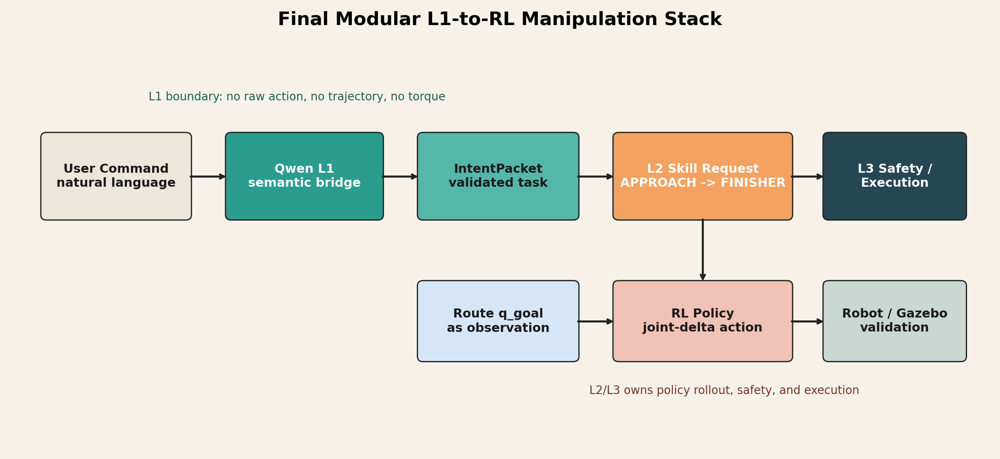
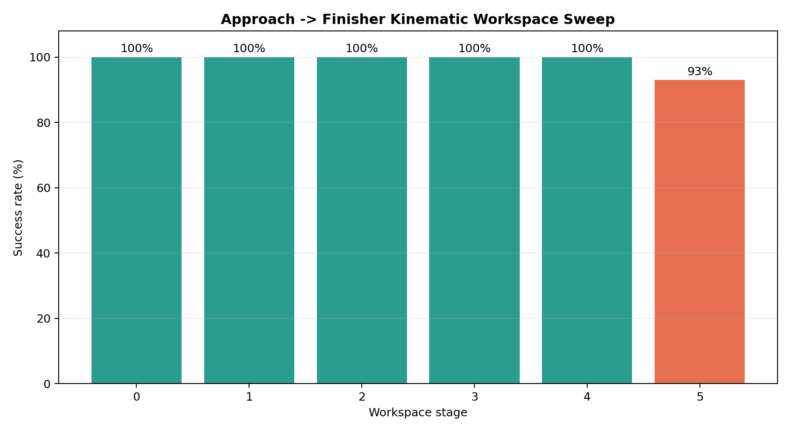
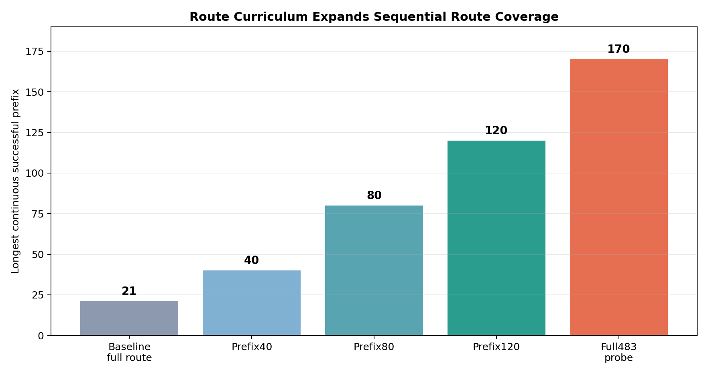
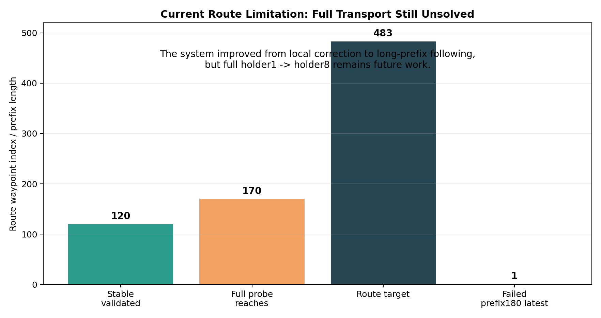

# Modular L1-to-RL Manipulation Stack with Route-Curriculum Extension

**Course:** ENPM690 Final Project  
**Project:** Robot Brain Trainer  
**Author:** Che-Jung Chuang  
**Date:** May 2026

## 1. Abstract

This project implements a modular L1/L2/L3 robot learning stack for kitchen-style manipulation. L1 is a Qwen semantic bridge that turns a natural-language command into a validated `IntentPacket`; L2/L3 contain the learned kinematic manipulation stack and deterministic execution boundary. The Phase 2 controller was simplified to `Approach -> Finisher`, which reaches 93% success in the hardest current kinematic workspace stage with approximately 2.89 mm final position error and 0.0208 rad final orientation error. A route-curriculum extension further expands the learned controller from local waypoint correction to long-prefix route following: the original full-route probe had longest prefix 21, while the route-trained policy reaches prefix120 with 100% sequential success and reaches prefix170 in a full 483-waypoint probe. Full holder1-to-holder8 Gazebo kitchen transport is not yet solved.

## 2. Motivation

Kitchen manipulation is difficult to debug as a monolithic end-to-end system. Semantic interpretation, learned motor control, and low-level execution have different failure modes. This project therefore separates the stack into three layers:

- L1: semantic intent using Qwen / VLM-style reasoning.
- L2: learned RL skill policy.
- L3: deterministic execution and safety boundary.

This decomposition makes the system easier to inspect: the LLM cannot directly move the robot, and the motor policy does not need to solve natural-language understanding.

## 3. Original Proposal vs Final Scope

The original proposal targeted a modular kitchen manipulation pipeline:

```text
L1 semantic interpretation -> L2 learned skill -> L3 safe execution
```

The final scope is a structured proof-of-concept:

- A Qwen bridge that produces validated structured commands.
- A kinematic RL skill stack.
- Route-curriculum numeric validation.

The final system does not claim full Gazebo physics completion, real camera grounding, or real robot deployment.

## 4. System Architecture



The key contract is that L1 never emits raw controls. Qwen can choose object, source slot, target slot, and constraints. L2/L3 own policy inference, safety, and execution.

## 5. Phase 1 Baseline

Phase 1 established the research infrastructure:

- Gymnasium kinematic environment.
- PPO/TD3 training.
- Deterministic evaluation.
- Isolated approach and dock policies.

However, Phase 1 did not solve final integration. Approach/dock switching was unreliable, and the VLM/Qwen component had not started. Phase 1 proved infrastructure rather than final behavior.

## 6. Phase 2 Skill Stack

Phase 2 simplified the final control path to:

```text
Approach -> Finisher
```

Dock-Coarse, Bridge, readiness classifier, acceptance maps, and finisher adaptation were diagnostic tools. They helped reveal that adding modules was not always helpful; once Approach could produce clean handoff states, the cleanest final path was `Approach -> Finisher`.

| Stage | Success | Handoff Pos Error | Handoff Ori Error | Final Pos Error | Final Ori Error |
|---:|---:|---:|---:|---:|---:|
| 0 | 1.00 | 0.50 mm | 0.0073 rad | 1.67 mm | 0.0106 rad |
| 1 | 1.00 | 0.62 mm | 0.0099 rad | 1.67 mm | 0.0123 rad |
| 2 | 1.00 | 0.85 mm | 0.0119 rad | 1.82 mm | 0.0139 rad |
| 3 | 1.00 | 1.20 mm | 0.0138 rad | 2.14 mm | 0.0164 rad |
| 4 | 1.00 | 1.71 mm | 0.0150 rad | 2.53 mm | 0.0165 rad |
| 5 | 0.93 | 1.96 mm | 0.0177 rad | 2.89 mm | 0.0208 rad |

The most demanding Stage 5 reached 93% success, with about 2.89 mm final position error and 0.0208 rad final orientation error.



## 7. Qwen L1 Bridge

The Qwen bridge exposes a structured tool interface:

- `get_l1_scene_context`
- `resolve_intent_packet`
- `prepare_phase1_skill_request`

For the command:

```text
Move tray1 from shelf_A1 to shelf_B1 while keeping it level and inserting with a stable pose.
```

Qwen produces a structured call to `resolve_intent_packet`, resolving:

```text
object_id: tray1
source_slot: shelf_A1
target_slot: shelf_B1
constraints: speed_cap = SLOW
resolved command: MOVE_PLATE(shelf_A1, shelf_B1)
pipeline: APPROACH -> FINISHER
target pose: [-0.92, -1.16, 1.22]
orientation: [3.14, 0.0, 3.14]
```

This validates the semantic-to-RL contract without letting the LLM emit low-level robot controls.

## 8. Route Curriculum Extension

The route curriculum was added after discovering that the policy was a strong local controller but not a full scene-level transport controller.

Before route curriculum:

```text
full483 success rate: 0.0435
longest continuous success prefix: 21
```

Implementation changes:

- Dense q-goal route target.
- Route-specific observation keys: `route_q_goal`, `route_q_error`, `route_tangent`, `route_scalar`.
- Prefix curriculum.
- Sequential actual-final-q evaluation.

After route curriculum:

```text
prefix120 sequential success: 1.0
prefix120 route distance: 1.720 m
full483 probe success: 0.4741
full483 longest prefix: 170
first failure index: 171
first failure reason: position
```



## 9. Negative Results and Lessons

Several negative results are central to the final interpretation:

- Prefix180 direct fine-tune failed early-prefix retention.
- Prefix180 anti-forgetting retry also failed.
- Sampled training success can be misleading.
- Sequential actual-final-q evaluation is the real route metric.
- Teacher-anchor smoke was promising, but a longer latest checkpoint drifted.

This means future training needs sequential-gated checkpoint selection, not only longer PPO fine-tuning.



## 10. Phase 3A Real Gazebo Evidence

The final package now includes a real Gazebo / ROS2 controlled-sim evidence run, separate from the report-style videos.

Verified artifact:

```text
video: report/videos/real_gz_camera_phase3a_controlled_sim.mp4
run id: final_real_gz_sensor_demo_005
step log: artifacts/v5/phase3a_controlled_sim/final_real_gz_sensor_demo_005/runtime_steps.jsonl
```

This run launched the kitchen scene, recorded the Gazebo side camera topic `/v5/cam/side/rgb`, loaded the frozen `Approach -> Finisher` policies, and sent commands through the ROS action path `/arm_controller/follow_joint_trajectory`.

| Metric | Value |
|---|---:|
| Target count | 3 |
| Runtime steps | 60 |
| Action goals executed successfully | 60 / 60 |
| Success rate on visible-workspace FK targets | 0.3333 |
| Mean final position error | 0.04586 m |
| Mean final orientation error | 0.03366 rad |
| Mean tracking error L2 | 0.0000807 |
| Gazebo camera frames captured | 251 |

This result should be interpreted carefully. It proves that the sim integration path is real and that the arm is commanded through the Gazebo/ROS controller stack, but it does not solve the complete holder1 -> holder8 tray transport. The best quantitative success result remains the kinematic `Approach -> Finisher` workspace sweep, while this Phase 3A run provides honest simulation evidence and exposes the remaining sim-transfer gap.

## 11. Limitations

The system does not yet solve:

- Full holder1 -> holder8 route transport.
- Full Gazebo physics validation.
- Image-grounded Qwen-VL perception.
- Contact, friction, and tray dynamics.
- Real robot deployment.

## 12. Future Work

### Route Curriculum

- Sequential-gated checkpoint selection.
- Teacher-anchor early stopping.
- Prefix180 / prefix260 expansion.

### Gazebo Validation

- Move the route-trained checkpoint into Phase 3A runtime.
- Validate controller timing and joint execution.
- Add collision/contact/object stability checks.

### Perception

- Replace structured scene proxy with image-grounded Qwen-VL scene estimation.
- Project paper/object geometry into a ground-plane coordinate frame before using visual headings.

## 13. Conclusion

This project demonstrates a modular architecture, a working kinematic `Approach -> Finisher` skill stack, a Qwen semantic bridge, and a route-curriculum extension from local correction to long-prefix route following. Full kitchen transport remains future work, but the modular learning stack and route-curriculum direction are validated by quantitative results.
