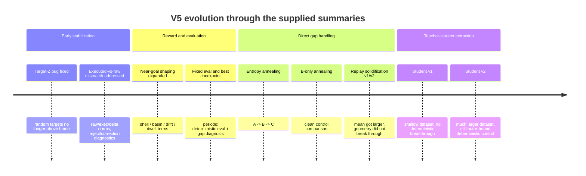

# V5.1 Analytical Report for Robot_brain_trainer

## Executive summary

The public repository landing page currently presents **V4 (sim2d)** as the mainline and describes **V5 manipulation** as the next stage, while the code directly available in this session is a supplied **V5.1** snapshot centered on `pipeline_e2e.py` and `sac_torch.py`. That distinction matters: the public repo tells the reader what the project officially ships today, but the technical analysis below is grounded primarily in the supplied V5.1 pipeline/agent code and in the detailed V5.1/V5.2 run summaries you provided. citeturn1view0 fileciteturn0file0 fileciteturn0file1

The strongest architectural fact in the V5.1 code is that it already fixes many of the “usual robotics RL mistakes.” The pipeline logs both **raw policy actions** and **executed actions**, stores both in replay, computes reward and diagnostics on executed behavior, runs deterministic post-train evaluation, runs periodic deterministic evaluation, computes explicit stochastic-to-deterministic gap metrics, and supports entropy annealing plus replay-based distillation. In other words, V5.1 is **not** failing because the project forgot to instrument or stabilize the loop. fileciteturn0file0 fileciteturn0file1

Your results narrow the problem substantially. Across entropy annealing, B-only annealing, replay-based solidification, stronger solidification v2, and teacher-student extraction, the same pattern repeats: **the stochastic teacher can approach the target basin, but deterministic control stalls around outer-hit quality and does not reliably convert to inner/dwell retention**. Stronger solidification increased deterministic action magnitude and improved the det/stoch action ratio, but did not produce the decisive geometric improvement that would indicate true handoff of control. That is not the signature of “SAC is completely wrong.” It is the signature of **objective mismatch**: SAC is good at learning exploratory approach behavior, but the current system is asking a stochastic maximum-entropy policy—or a one-step action regressor trained on its data—to also become the final precision stabilizer. The literature is consistent with that diagnosis: SAC intentionally trades return against policy entropy, deterministic actor-critic methods optimize a deterministic deployment policy more directly, and offline/behavior-regularized methods such as AWR, AWAC, IQL, and TD3+BC work only insofar as the dataset contains enough support for the behavior you want to extract. citeturn10search1turn11search4turn10search8turn13search4turn22search2turn12search8turn21search5

The most important recommendation is therefore simple: **close V5.1 here**. Do not keep spending the next cycle making SAC mean actions slightly larger. The next step should be a **two-stage architecture**: keep SAC as a teacher/explorer for the outer approach, and add either a deterministic local controller or a deterministic fine-tuning stage for the inner retention phase. The best short-term path is a hybrid controller with explicit handoff in the basin; the best medium-term path is inner-heavy deterministic extraction plus deterministic fine-tuning with TD3+BC or a closely related objective. This direction is also consistent with modern real-robot RL systems, which increasingly rely on controllers, constraints, interventions, and structure—not just “pick the best actor-critic.” citeturn20view0turn23search1turn23search2

## Repository scope and system map

### Evidence base and scope

This report uses three evidence layers.

First, I directly inspected the supplied V5.1 snapshots of `pipeline_e2e.py` and `sac_torch.py`. Those files are sufficient to reconstruct the end-to-end dataflow, replay semantics, action/executor coupling, annealing path, checkpoint policy, and the built-in distillation logic. fileciteturn0file0 fileciteturn0file1

Second, I checked the public repository page. It confirms that the public-facing main branch still advertises **V4** as the active mainline, with V5 manipulation as the next phase, which implies that your V5.1/V5.2 work is either ahead of the public README or lives in code paths not yet surfaced in the repo front page. That matters for documentation and reproducibility. citeturn1view0

Third, I used the run summaries you supplied for entropy annealing, B-only + solidification, stronger solidification v2, teacher deterministic baselines, dataset v1/v2, and deterministic student v1/v2. Those summaries are treated here as **provided experimental facts**, but the corresponding JSON artifacts and V5.2 module files were not directly available in the current workspace, so those parts of the report are analytic rather than source-audited.

### Directly observed V5.1 dataflow

The V5.1 pipeline is a single-path arm-control loop. The observation is assembled from **joint positions `q`**, **joint deltas `dq`**, **end-effector pose error**, and **previous action**. The agent is a Gaussian SAC actor whose action is squashed with `tanh` and scaled by `action_scale`; the action then goes through an executor path with clamping, rate limiting, and projection before being executed on the runtime. Replay stores both the **raw action** and the **executed action**, plus adjustment metadata such as `delta_norm`, `raw_norm`, `exec_norm`, clamp/projection flags, and rejection flags. Critics train on executed-action transitions, and the actor’s sampled actions are also passed through an executor proxy before Q-evaluation. fileciteturn0file0 fileciteturn0file1

```mermaid
flowchart LR
    O[Observation<br/>q, dq, ee pose error, prev action]
    A[SAC Gaussian actor<br/>mu, log_std]
    S[Sample / deterministic mean<br/>tanh(.) * action_scale]
    E[L3 executor<br/>clamp, rate limit, projection, reject]
    R[Runtime / Gazebo / robot]
    N[Next state + executed motion]
    W[Reward composer + trace summaries]
    B[Replay buffer<br/>raw_act, exec_act, norms, flags]
    C[Critics train on exec_act]
    P[Actor update via executor proxy]

    O --> A --> S --> E --> R --> N --> W --> B
    B --> C
    B --> P
    P --> A
```

That design is materially better than a naïve setup that ignores safety corrections. The replay schema in `sac_torch.py` explicitly separates `raw_actions` and `exec_actions`, and the pipeline’s episode runner writes the same distinction into traces. fileciteturn0file0 fileciteturn0file1

### Where V5.1 already went beyond a baseline SAC loop

The pipeline adds several mechanisms that many RL manipulation projects only discover later:

| Capability | Evidence in code | Why it matters |
|---|---|---|
| Executed-vs-raw action accounting | replay stores both; runtime/reward traces log both | Prevents training on actions the robot never actually took |
| Deterministic post-train evaluation | `_run_post_training_eval_gz` | Separates train-time stochastic competence from deploy-time competence |
| Gap diagnosis across noise scales | `_run_gap_diagnosis_gz` | Measures whether noise is doing the real work |
| Event/fixed entropy annealing | `EntropyAnnealManager` | Lets you compress policy entropy after exploration |
| Replay-based action distillation | `_sample_distill_batch`, `_run_distill_step` | Pulls “good” executed actions toward the mean policy |
| Best-checkpoint selection tied to deterministic evaluation | periodic eval + checkpoint scoring | Prevents choosing a purely stochastic winner |

All of those are directly visible in the supplied files. fileciteturn0file0 fileciteturn0file1

### Project timeline as reconstructed from your summaries



## Confirmed findings and root-cause analysis

### What is confirmed from code

Several key claims are no longer hypotheses; they are direct code facts.

The deterministic evaluation action is produced by the actor’s **mean path**, while stochastic behavior samples from a Gaussian whose scale can be externally modulated by `exploration_std_scale`. In deterministic mode, `noise` and `std_scaled` are forced to zero; in stochastic mode, the sample is drawn from `Normal(mu, std * exploration_std_scale)`. That is exactly the mechanism that can create a stochastic-to-deterministic deployment gap in SAC. fileciteturn0file1

The actor is trained under a **maximum-entropy SAC objective** plus optional BC loss and optional replay distillation. The entropy coefficient `alpha` is learned toward `target_entropy`, and the code explicitly supports runtime changes of `target_entropy` via `set_target_entropy`. The original SAC formulation is designed to maximize both reward and entropy; that is a feature for exploration, but it can be a liability if the deployment requirement is a crisp deterministic precision controller. fileciteturn0file1 citeturn10search1turn11search4

The replay distillation path is still **one-step executed-action regression**. It selects “good” transitions based on next-step distance, progress, success/dwell flags, safety filters, and a hand-built quality score, then regresses the current mean action toward the executed action, optionally reweighted by a critic-derived advantage term. This is much more sophisticated than pure BC, but it is still fundamentally a **single-step supervised target** attached to the current state distribution. fileciteturn0file1

The observation seen by the policy does **not** explicitly include phase or dwell-state features such as “currently in outer shell,” “currently in inner shell,” “dwell count,” or “armed for settle mode.” The policy sees geometric error and previous action, but not an explicit phase label. That omission is important because the task has clearly evolved into a **phase-dependent** control problem. fileciteturn0file0

### What is confirmed from the supplied results

From your supplied runs, three experimental facts dominate the interpretation.

The first is that entropy annealing and both versions of solidification **did increase deterministic mean action magnitude**. The det/full action ratio rose from roughly **0.039** in the earlier baseline to **0.0602** in solidification v1 and **0.0826** in v2, so the system really was pulling some behavior back into the mean.

The second is that this did **not** translate into the desired geometry. Periodic deterministic outer hit remained capped around **0.2**, deterministic inner hit stayed at **0.0**, and deterministic dwell remained **0.0**.

The third is that teacher-student extraction did **not** beat the teacher deterministic baseline, even after dataset scaling. Your v2 dataset improved from **100** to **456** transitions and finally included **29 inner** and **9 dwell** samples, but it still remained heavily outer-dominated, and the deterministic student stayed essentially outer-bound.

Those three facts together rule out a lot of dead ends. The problem is not “the mean never moves.” It does. The problem is that **making the mean larger is not the same thing as making the policy better at inner-phase control**.

### Root causes

The table below separates high-confidence root causes from secondary contributors.

| Root cause | Confidence | Why it fits the evidence | Practical implication |
|---|---:|---|---|
| **Deployment-objective mismatch** between stochastic SAC training and deterministic precision deployment | High | SAC explicitly optimizes reward plus entropy; deterministic eval uses the mean path, while success often comes from sampled deviations. Entropy annealing helped action size but not inner retention. fileciteturn0file1 citeturn10search1turn11search4 | Keep SAC as explorer/teacher, not as the final precision controller |
| **One-step extraction is too shallow** for inner stabilization | High | Distill and student losses are action regression losses to executed actions. They do not explicitly optimize multi-step retention, anti-regression, or dwell stability. fileciteturn0file1 | Extraction must become trajectory-aware or be followed by deterministic fine-tuning |
| **Inner/dwell data support is too thin and imbalanced** | High | Your supplied dataset v2 still has only 29 inner and 9 dwell samples versus 268 outer samples. Weighted extraction cannot create modes that are barely present in the data. | Collect targeted data in the outer→inner boundary, not just more of everything |
| **No explicit phase signal in the policy input** | Medium-high | The task behaves like a two-phase problem: “get into basin” and “settle inside basin.” Current observations do not explicitly tell the policy which control regime it should be in. fileciteturn0file0 | Add a phase flag or use an explicit hybrid controller |
| **Executor proxy is helpful but incomplete** | Medium | The actor update uses an executor proxy with clamp/rate-limit/joint bounds, but it still cannot model all runtime quirks such as true contact/no-effect behaviors. fileciteturn0file1 | A local feedback controller can absorb residual mismatch better than pure policy regression |
| **Mean-regression can average over multimodal corrective actions** | Medium | Plain MSE regression is known to blur multimodal action targets; modern policy models often improve by modeling richer action distributions or sequences. Diffusion Policy is one prominent example. citeturn16search2turn16search4 | If extraction remains supervised, avoid relying only on pointwise MSE to a single action |

### What is not the root cause

It is important to say what V5.1 has already falsified.

This is **not primarily a curriculum problem**. You already locked action stage and target stage and saw similar behavior.

This is **not primarily a safety-collapse problem**. The code and your summaries show low reject rates and essentially no catastrophic executor pathology in the strongest runs. The system is no longer dominated by clamp/projection chaos. fileciteturn0file0

This is **not primarily a logging or evaluation blind-spot**. V5.1 has unusually strong instrumentation for this stage of a project. fileciteturn0file0

This is also **not evidence that SAC is useless**. It is evidence that SAC is doing the exploration half of the job better than the deployment half. Deterministic policy gradient methods exist precisely because in continuous control it is often useful to learn a deterministic target policy from exploratory behavior. citeturn10search8

## Literature-backed alternatives

### Hybrid outer-policy plus local inner controller

This is the highest-priority alternative.

Your evidence strongly suggests the project has become a **phase-structured manipulation problem**. The outer phase is “enter the basin safely and often.” SAC already does that moderately well. The inner phase is “reduce residual error and hold position without drifting.” That second problem is often easier to solve with **explicit structure** than by hoping a single stochastic actor and a one-step extractor will discover it.

A highly relevant reference is **RL with Shared Control Templates (RL-SCT)** for real-world in-contact manipulation. Their central claim is that known geometry and task constraints should be encoded explicitly so RL focuses on what remains unknown; this reduces action/state space, improves safety, and simplifies reward design. They demonstrate real-robot contact-rich learning in tens of episodes rather than thousands. Modern robotics RL toolkits such as **SERL** and **HIL-SERL** likewise emphasize controllers, resets, interventions, and human guidance as first-class ingredients, not incidental extras. citeturn20view0turn23search1turn23search2

For your system, the concrete version is:

- keep the current SAC teacher or best deterministic extractor as the **outer approach policy**;
- when `dpos` crosses an outer threshold, switch to a **local resolved-rate / damped-IK / PD-in-task-space controller** that explicitly minimizes EE position error and optionally damps joint motion;
- keep **hysteresis** on the handoff so the system does not chatter between modes;
- define success on the hybrid controller’s ability to produce the first **deterministic inner and dwell** hits.

This option matches your evidence much better than more solidification, because it directly addresses the missing behavior: precise local stabilization.

### Inner-heavy deterministic extraction with weighted trajectory learning

The second best option is not “more student,” but **better student data and a better student target**.

AWR, AWAC, and IQL all formalize the idea that when learning from replay or offline data, the policy update should be a **weighted supervised objective** where better actions receive more weight. TD3+BC shows that even very simple actor regularization can be strong if the target policy is deterministic and the data distribution is respected. These methods are particularly relevant because your current distill path is already partway there: it computes selection scores, safety filters, and even an advantage-based reweighting term. citeturn13search4turn22search2turn12search8turn14search3turn21search5

But two changes are needed.

The first change is **dataset curation**. Right now, your supplied dataset is still outer-heavy. You should not sample “good” transitions from the whole replay uniformly and hope weights fix it. You need active rebalancing toward the specific states you care about: the narrow band from outer to inner, the first successful settles, and the states just before regression.

The second change is **sequence or short-horizon extraction**, not only one-step action regression. The student should learn that from a given state the correct behavior is not merely “take this action,” but “take an action that reduces final error over the next k steps and preserves residence in the basin.” If you want to keep the student deterministic, that is fine—but the training target needs to reflect **retention**, not just imitation of a single action.

This option is the best path if you want to preserve the teacher-student architecture and extract a deterministic student before any online fine-tuning.

### Deterministic fine-tuning with TD3+BC after extraction

If the deployment requirement is deterministic, then at some point it is reasonable to switch to an algorithm that is natively aligned with deterministic deployment. That is what the deterministic policy gradient family gives you, and **TD3** remains one of the strongest simple baselines for continuous control. **TD3+BC** is especially attractive because it lets you initialize from a dataset-derived actor and regularize the deterministic policy toward supported actions while still optimizing Q. citeturn10search5turn14search0turn21search5turn14search6

This is a very good fit for your project because V5.1 already has several prerequisites:

- executor-aware replay,
- deterministic evaluation,
- good checkpoint/report infrastructure,
- and a clear teacher/data collection path.

The practical recipe is:

1. extract the best deterministic student or copy the teacher mean actor,
2. initialize a **TD3 actor** with those weights,
3. initialize critics from scratch or partially from the SAC critics only if the parameterization is compatible,
4. start with **offline pretraining / offline fine-tune** on the curated dataset,
5. then optionally run a **very small online fine-tune** in the real loop.

This is much more promising than continuing to enlarge the SAC mean because it removes the “maximize entropy” pressure at the deployment stage.

### Targeted data collection around the outer→inner boundary

This is the most valuable supporting tactic and should happen alongside either of the above two options.

The logic comes from **DAgger** and from robotics imitation systems such as **BC-Z** and **HIL-SERL**: if the learner fails on the states it induces, collect data specifically on those states and aggregate it. BC-Z also shows that interventions, not only pristine demonstrations, can be useful at scale. citeturn17search2turn16search3turn16search1turn23search2

For your project, the narrow-band collection policy should be:

- trigger collection when the trajectory first enters outer;
- request teacher/stochastic corrections only in the next 1–3 steps;
- oversample states where the system **almost** reaches inner but regresses;
- label trajectory windows by final retention quality, not only by stepwise improvement.

This is likely a much better use of data budget than adding another broad collection run.

### Hindsight relabeling as a secondary option

Because the task is already goal-conditioned through the target embedded in the observation, **HER-style relabeling** may also be useful as a secondary dataset multiplier. HER is not the main answer here, because your bottleneck is not only sparse reward but deterministic retention. Still, for target-conditioned manipulation it can cheaply increase the effective amount of successful target-following data and may improve extractor pretraining or a deterministic fine-tuning stage. citeturn15search0turn15search6

## Prioritized action plan and experiment matrix

### Recommended order

The short version is:

1. **Freeze V5.1** and document it clearly.
2. **Implement a hybrid local inner controller.**
3. In parallel, build **deterministic extraction v3** with inner-heavy curation and short-horizon weighting.
4. If extraction still plateaus at outer, switch to **TD3+BC fine-tuning** on top of the extracted policy.
5. Only after that consider more ambitious sequence or diffusion-style policies.

### Minimal experiment matrix

| Priority | Experiment | Hypothesis | Required code change | Success criteria | Stop condition |
|---|---|---|---|---|---|
| P0 | V5.1 closure + artifact cleanup | Reproducibility will improve and moving targets will stop | Docs only | Clear closure summary committed; README points to V5.1 report | None |
| P1 | **Hybrid local controller** | Explicit basin handoff will convert deterministic outer into inner/dwell | Add phase switch + local EE controller + hysteresis | First stable **deterministic inner hit > 0**; regression rate decreases; mean final dpos improves beyond teacher best | If deterministic outer does not rise above current baseline after 2–3 trigger settings |
| P2 | **Extraction v3** | Curated, inner-heavy, short-horizon weighted extraction will outperform one-step student | Dataset builder + student loss + sampling weights | Deterministic inner hit > 0 or clear rise in final-basin retention | If student still saturates at outer after curated data and sequence loss |
| P3 | **TD3+BC fine-tune** | Deterministic objective alignment will improve precision deployment | Add `td3_torch.py`, init from student or teacher mean | Deterministic outer > 0.2 and inner > 0; no major safety regression | If TD3 fine-tune destabilizes train safety or underperforms hybrid controller |
| P4 | Narrow-band DAgger/HIL collection | Additional data specifically on learner-induced failure states is more valuable than generic replay | Collection script + data tags | Inner/dwell examples increase materially; extraction/fine-tune improves | If added data remains mostly outer-only |
| P5 | HER-style relabeling | Goal relabeling increases useful support for target-conditioned training | Replay relabeling path | Better offline pretrain stability or smaller data requirement | If no measurable gain in offline validation |

### Proposed validation metrics

Keep the metrics that matter most to this project:

- `det_true_outer_hit_rate`
- `det_true_inner_hit_rate`
- `det_true_dwell_hit_rate`
- `det_mean_final_dpos`
- `det_regression_rate`
- `det_action_l2 / stoch_action_l2`
- `true_final_basin_rate`
- safety guardrails: reject rate, execution_fail rate, projection/clamp counts

The first serious success signal for the next stage is **not** “higher det_action_l2.” It is:

- deterministic outer clearly above the current ceiling,
- deterministic inner **non-zero**,
- and regression rate materially below the current level.

### Proposed CLI examples for the top three changes

These are **proposed command shapes**, not commands that exist yet.

**Hybrid local controller**

```bash
python -m hrl_trainer.v5_1.pipeline_e2e \
  --policy-mode sac_torch \
  --controller-mode hybrid_local \
  --hybrid-trigger-outer-m 0.080 \
  --hybrid-release-m 0.100 \
  --local-controller damped_ik \
  --local-kp-pos 0.60 \
  --local-kd-joint 0.10 \
  --local-max-delta-scale 0.35 \
  --run-id v5_1_hybrid_local_001 \
  ...
```

**Deterministic extraction v3**

```bash
python -m hrl_trainer.v5_2.build_teacher_dataset \
  --sources artifacts/v5_1/e2e/... \
  --oversample-zone inner:4,dwell:8 \
  --include-pre-regression-windows \
  --window-size 3 \
  --output artifacts/v5_2/datasets/det_extract_v3

python -m hrl_trainer.v5_2.train_deterministic_student \
  --dataset artifacts/v5_2/datasets/det_extract_v3 \
  --loss awr_sequence \
  --seq-len 3 \
  --weight-source advantage_or_inverse_final_dpos \
  --run-id det_student_v3_001
```

**TD3+BC fine-tune**

```bash
python -m hrl_trainer.v5_2.train_td3_finetune \
  --init-actor-checkpoint artifacts/v5_2/students/det_student_v3_001/best.pt \
  --offline-dataset artifacts/v5_2/datasets/det_extract_v3 \
  --td3-bc-alpha 2.5 \
  --online-episodes 20 \
  --action-scale 0.08 \
  --run-id td3bc_finetune_v1_001
```

## Papers, documentation edits, and implementation tickets

### Primary papers and official implementations most relevant to this project

These are the references that matter most for your next architectural decision.

**SAC and deterministic deployment mismatch**
- *Soft Actor-Critic: Off-Policy Maximum Entropy Deep Reinforcement Learning with a Stochastic Actor* — the original SAC paper and the clearest source for why the actor optimizes reward plus entropy. citeturn10search1
- *Soft Actor-Critic Algorithms and Applications* — the extended SAC reference and official implementation lineage. citeturn11search4turn14search2
- Official SAC repositories from the Berkeley authors: `haarnoja/sac` and `rail-berkeley/softlearning`. citeturn14search1turn14search2

**Deterministic actor-critic**
- *Deterministic Policy Gradient Algorithms* — the conceptual anchor for learning a deterministic policy from exploratory data. citeturn10search8
- *Addressing Function Approximation Error in Actor-Critic Methods* — TD3, still the canonical deterministic deep actor-critic baseline. citeturn10search5
- Official TD3 implementation by the paper author. citeturn14search0

**Behavior-regularized and weighted extraction**
- *Advantage-Weighted Regression* — simple weighted policy regression from replay. citeturn13search4
- *AWAC: Accelerating Online Reinforcement Learning with Offline Datasets* — highly relevant because it was motivated by real-world robotics and offline-to-online improvement. citeturn22search2turn22search6
- *Offline Reinforcement Learning with Implicit Q-Learning* — strong offline improvement method with official implementation. citeturn12search8turn14search3
- *A Minimalist Approach to Offline Reinforcement Learning* — TD3+BC, especially relevant if you want a deterministic fine-tuning stage with minimal code complexity. citeturn21search5turn14search6

**Targeted data aggregation and intervention-heavy robotics learning**
- *A Reduction of Imitation Learning and Structured Prediction to No-Regret Online Learning* — DAgger, the core reference for collecting corrections on learner-induced states. citeturn17search2
- *BC-Z: Zero-Shot Task Generalization with Robotic Imitation Learning* — important because it explicitly leverages demonstrations and interventions in a large robotic manipulation pipeline. citeturn16search3turn16search1
- *HIL-SERL* and *SERL* — practical modern systems showing that sample-efficient robotic RL depends as much on controllers, demos, resets, and interventions as on the optimizer itself. citeturn23search1turn23search2turn23search6

**Structure and controller-guided RL for contact-rich tasks**
- *Guiding real-world reinforcement learning for in-contact manipulation tasks with Shared Control Templates* — perhaps the single most relevant paper for your next move, because it argues directly for adding structure and constraints instead of asking RL to learn known geometry from scratch. citeturn20view0

### Suggested repository documentation edits

The public README should be updated so the repo narrative matches where the work actually is. Right now the landing page still frames the project around V4 sim2d. citeturn1view0

I recommend these additions:

| File | Purpose |
|---|---|
| `docs/V5_1_CLOSURE_SUMMARY.md` | Freeze the factual outcome of V5.1 |
| `docs/V5_1_ARCHITECTURE.md` | Explain obs → SAC → executor → runtime → replay, plus eval and gap diagnosis |
| `docs/V5_1_EXPERIMENT_LEDGER.md` | List all V5.1 runs, key settings, and result summary |
| `docs/V5_2_EXTRACTION_NOTES.md` | Document teacher dataset and student extraction findings |
| `README.md` | Add a note that public mainline is V4, while V5 manipulation reports live under docs |

### Example implementation tickets for the top three changes

**Issue: Add hybrid local controller for basin stabilization**

> **Goal**  
> Add a two-stage controller in V5.1/V5.2: use the existing policy for outer approach, then switch to a deterministic local controller inside the basin.
>
> **Scope**  
> - Add controller arbitration logic to `pipeline_e2e.py`  
> - Implement local EE-error controller with hysteresis  
> - Log phase transitions and local-controller metrics  
> - Evaluate on the existing fixed eval suite
>
> **Acceptance criteria**  
> - New flags for trigger radius, release radius, local gains  
> - No safety regression relative to V5.1 best run  
> - First deterministic inner hit > 0 on fixed eval suite

**Issue: Build deterministic extraction v3 with inner-heavy curation**

> **Goal**  
> Replace one-step outer-heavy extraction with curated, short-horizon, inner-heavy deterministic extraction.
>
> **Scope**  
> - Extend dataset builder to oversample inner/dwell and pre-regression windows  
> - Add short-horizon weighted loss to student trainer  
> - Export dataset composition and validation metrics
>
> **Acceptance criteria**  
> - Dataset report shows materially higher inner/dwell representation  
> - Student validation improves on final-basin retention, not only action magnitude  
> - Deterministic evaluation shows either inner > 0 or clearly improved regression rate

**Issue: Add TD3+BC deterministic fine-tune path**

> **Goal**  
> Add a deterministic fine-tuning phase initialized from extracted student or teacher mean actor.
>
> **Scope**  
> - Implement `td3_torch.py` with replay schema compatible with V5.1  
> - Add offline pretrain + small online fine-tune entry points  
> - Reuse executor-aware replay and fixed eval suite
>
> **Acceptance criteria**  
> - Actor can be initialized from existing checkpoints  
> - Deterministic eval outperforms student baseline on outer/inner/retention metrics  
> - Safety metrics remain within V5.1 bounds

### Draft V5.1 closure summary for repository docs

You can paste the following almost directly into a doc:

> ## V5.1 closure summary
>
> V5.1 successfully reduced the project risk from “the arm system is unstable and training/evaluation are untrustworthy” to a much narrower and clearer problem: **the stochastic teacher can approach the goal basin, but deterministic control remains stuck around outer-hit quality and does not reliably convert to inner/dwell retention**.
>
> The V5.1 pipeline already includes strong instrumentation and safety-aware design: executed-vs-raw action accounting, deterministic post-train evaluation, stochastic-to-deterministic gap diagnosis, periodic deterministic evaluation, best-checkpoint selection, entropy annealing, and replay-based action solidification. These additions established that the main bottleneck is **not** curriculum, reward visibility, or catastrophic safety correction.
>
> Across entropy annealing, B-only annealing, replay solidification, and stronger solidification, deterministic mean action magnitude increased, but deterministic geometry did not break through. Teacher-student extraction also improved retention only marginally and did not surpass the best deterministic teacher baseline, largely because deep inner/dwell examples remained too sparse relative to outer examples.
>
> The project conclusion at V5.1 is therefore:
>
> - SAC remains useful as an **exploration teacher**.
> - Plain SAC mean-policy consolidation is **not sufficient** for deterministic precision control.
> - The next architecture should be either:
>   - a **hybrid two-stage controller** with explicit local inner stabilization, or
>   - a **deterministic extraction + deterministic fine-tuning** pipeline such as TD3+BC.
>
> V5.1 is considered closed as a diagnostic and stabilization phase. The next phase should not focus on “making SAC mean bigger,” but on **making deterministic control structurally easier**.