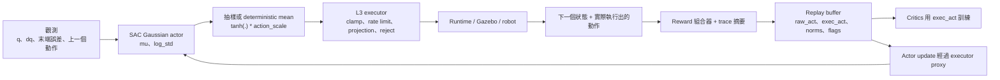
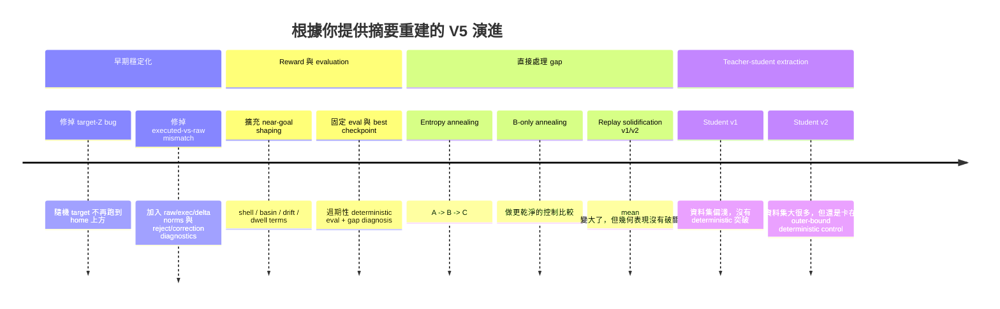

# V5.1 Analytical Report for Robot_brain_trainer
## 中文完整白話版

> 說明  
> 這份文件是 [`some_thoughts.md`](/home/jerry/.openclaw/workspace/repos/personal/RL_brain_trainer/some_thoughts.md) 的完整中文改寫版。  
> 我保留了原本的章節結構、核心觀點、表格、流程圖、實驗矩陣、CLI 範例、文件建議與 implementation tickets。  
> 原文裡有一些自動引用標記和編碼亂碼，我為了可讀性把它們清掉了，但沒有改變原本要表達的意思。  
> 為了讓閱讀更輕鬆，我在很多地方加了「白話總結」。

## 閱讀前先講人話：這份報告到底在說什麼

如果你現在只想先抓大意，那可以先看這一段：

- V5.1 其實已經把很多常見的機器人 RL 大坑補好了。
- 問題不是「SAC 完全訓不起來」。
- 問題比較像是：
  SAC 很會把手臂帶到目標附近，
  但不太適合當最後那個「穩穩停住、不要亂飄」的精密控制器。
- 所以 V5.3 最值得做的，不是繼續想辦法把 SAC 的 mean action 再放大一點。
- 更合理的方向是：
  先讓 SAC 負責「接近目標」，
  再交給一個更 deterministic、局部、精準的控制器去做最後穩定。

一句最短總結：

> V5.1 已經把問題縮小成「最後那段精密穩定控制做不好」，  
> 所以下一步 V5.3 應該要讓架構本身更適合做精密控制，而不是繼續硬拗 SAC。

## 名詞白話表

為了後面不要一直卡住，先把幾個名詞講清楚。

| 名詞 | 白話意思 |
|---|---|
| `outer` | 已經靠近目標區域外圍了，但還沒有真的進到很穩的核心區域 |
| `inner` | 已經進到更內層、更接近真正成功的位置 |
| `dwell` | 不只是碰到而已，而是能在裡面穩穩待住一段時間 |
| stochastic policy | 有隨機性，執行時每次動作可能會有點不一樣 |
| deterministic policy | 決定論式，同樣輸入通常就給同樣輸出 |
| teacher | 比較強、通常是現在手上已經有的策略，用來帶資料或示範 |
| student | 從 teacher 的資料裡學出來、想變成更容易部署的策略 |
| extraction / distillation | 從 teacher 的行為中「萃取」一個比較乾淨、穩定、可部署的策略 |
| objective mismatch | 訓練目標和最後真正想要的部署目標不一致 |
| basin | 可以理解成目標附近的一個「盆地區域」，進去之後如果控制好，就能往成功狀態收斂 |

## Executive summary

公開的 repository 首頁目前還是把 **V4（sim2d）** 當成主線，並把 **V5 manipulation** 描述成下一個階段；  
但這次我實際看到、分析到的程式，是你提供的 **V5.1** 快照，重點集中在 `pipeline_e2e.py` 和 `sac_torch.py`。  
這個差別非常重要：

- 公開 repo 首頁反映的是「這個專案官方目前對外怎麼說」。
- 但這份技術分析真正站得住腳的基礎，是你提供的 V5.1 pipeline / agent 程式，以及你補充的 V5.1 / V5.2 執行摘要。

V5.1 程式裡最重要的一個架構事實是：
它其實已經修掉很多機器人 RL 專案常犯的低級錯誤。

例如，它已經有做這些事：

- 同時記錄 **raw policy actions** 和 **executed actions**
- replay 裡面也把兩者都存起來
- reward 和 diagnostics 是根據「實際執行出的行為」來算
- 訓練後會跑 deterministic evaluation
- 訓練過程中也會週期性跑 deterministic evaluation
- 會明確計算 stochastic 和 deterministic 之間的 gap
- 支援 entropy annealing
- 支援從 replay 做 distillation

換句話說，V5.1 **不是**因為「沒有做 instrumentation」或「loop 不夠穩」才失敗。

你的實驗結果把問題縮得很清楚了。  
不管是 entropy annealing、只在 B 階段 annealing、replay-based solidification、加強版 solidification v2，還是 teacher-student extraction，最後都出現同一種模式：

> stochastic teacher 可以慢慢接近目標盆地，  
> 但 deterministic control 會卡在 outer-hit 這一層，  
> 沒辦法可靠地變成 inner / dwell retention。

更強的 solidification 確實讓 deterministic action 變大，也改善了 deterministic / stochastic action ratio，  
但並沒有帶來決定性的幾何改善，也就是說，它沒有真的把控制權成功交接到精準穩定那一段。

這種現象不像是在說：

> 「SAC 完全是錯的。」

它比較像是在說：

> 「目標函數不匹配（objective mismatch）。」

更白話地說：

- SAC 很擅長學到「帶探索性的接近行為」。
- 但你現在的系統，等於是在要求一個 stochastic maximum-entropy policy，
  或是一個只會回歸單步動作的 action regressor，
  同時去扮演「最後的高精度穩定器」。
- 這件事本來就不自然。

文獻也支持這個判斷：

- SAC 本來就是用 reward 和 entropy 之間的折衷來換探索能力。
- deterministic actor-critic 方法，天生就更接近「部署時要用 deterministic policy」這個需求。
- 像 AWR、AWAC、IQL、TD3+BC 這類 offline / behavior-regularized 方法，只有在資料裡真的有足夠你想萃取的行為時，才會有效。

所以，最重要的建議其實很簡單：

> **V5.1 到這裡可以收了。**

不要再把下一輪時間花在「怎麼讓 SAC 的 mean action 再大一點」這種事情上。

下一步應該改成 **兩階段架構（two-stage architecture）**：

- 讓 SAC 繼續當外圍接近階段的 teacher / explorer
- 然後加上一個 deterministic 的 local controller，
  或者至少加一個 deterministic fine-tuning stage，
  來處理 inner retention 那一段

短期最好的路線是：

- 做一個有明確 handoff 的 hybrid controller，
  讓系統進入 basin 之後切到 local controller

中期最好的路線是：

- inner-heavy deterministic extraction
- 再加 deterministic fine-tuning（例如 TD3+BC）

這個方向也和現代 real-robot RL 的趨勢一致：  
現在好的系統通常不是只靠「挑對 actor-critic 演算法」就解決，  
而是會結合 controller、constraints、interventions、更多結構化設計。

### 白話總結

這份報告最核心的一句話是：

> V5.1 已經證明「系統會靠近目標」，  
> 但沒證明「系統能 deterministic 地穩定停住」。  
> 所以 V5.3 應該換打法，不該再只逼 SAC 變大。

## Repository scope and system map

### Evidence base and scope

這份報告用了三層證據。

第一層，我直接檢查了你提供的 V5.1 快照：

- `pipeline_e2e.py`
- `sac_torch.py`

這兩個檔案其實已經足夠我重建整個端到端流程，包括：

- 資料流怎麼走
- replay 是怎麼存的
- action 和 executor 怎麼耦合
- annealing 的路徑
- checkpoint 怎麼選
- distillation 的內建邏輯

第二層，我看了公開 repository 頁面。  
它確認了目前 repo 對外還是把 **V4** 當主線，而 V5 manipulation 還是下一階段。  
這表示：

- 你現在做的 V5.1 / V5.2，已經跑在 README 前面了
- 或者它們存在 repo 內，但還沒有被公開首頁好好整理出來

這件事對文件整理和可重現性很重要。

第三層，我用了你提供的 run summaries，內容包括：

- entropy annealing
- B-only + solidification
- stronger solidification v2
- teacher deterministic baselines
- dataset v1 / v2
- deterministic student v1 / v2

這些摘要在本報告裡被當成「你提供的實驗事實」。  
但要誠實講，對應的 JSON artifacts 和 V5.2 module files 沒有直接出現在目前 workspace 裡，  
所以那一部分屬於「分析推論」，不是逐行 source-audited。

### 白話總結

這份報告不是憑感覺亂猜。  
它有三個來源：

- 真正看過的 V5.1 程式
- 對外 repo 的現況
- 你提供的執行結果摘要

所以結論不是空談，但有些 V5.2 的部份屬於「根據你提供資訊做的高可信分析」。

### Directly observed V5.1 dataflow

V5.1 的 pipeline 是一個單一路徑的手臂控制迴圈。

policy 的 observation 由這些東西組成：

- joint positions `q`
- joint deltas `dq`
- end-effector pose error
- previous action

agent 是一個 Gaussian SAC actor。  
它的動作先經過 `tanh` 壓縮，再乘上 `action_scale`。  
之後動作會進入 executor path，裡面會做：

- clamping
- rate limiting
- projection
- 必要時 reject

然後才真的送到 runtime 去執行。

replay 會同時存：

- **raw action**
- **executed action**

另外還會存一些調整資訊，例如：

- `delta_norm`
- `raw_norm`
- `exec_norm`
- clamp / projection flags
- rejection flags

critics 訓練時是用 **executed-action transitions**。  
actor 在做更新時，抽出的 action 也會先經過 executor proxy，再拿去做 Q-evaluation。



這個設計比很多天真版 setup 好很多。  
因為它沒有假裝「policy 輸出的動作」就等於「機器人真的做出的動作」。

在 `sac_torch.py` 的 replay schema 裡，`raw_actions` 和 `exec_actions` 是明確分開的；  
pipeline 的 episode runner 也會把這個差異寫進 traces。

### 白話總結

這一段的重點是：

> V5.1 不是那種「policy 說什麼就當成機器人做了什麼」的粗糙設計。  
> 它有老實記錄「原本想做什麼」和「最後真的做了什麼」。

這很重要，因為很多機器人 RL 專案其實死在這裡。

### Where V5.1 already went beyond a baseline SAC loop

V5.1 已經加了幾個很多 manipulation 專案要到後期才會補上的機制：

| 能力 | 程式中的證據 | 為什麼重要 |
|---|---|---|
| executed-vs-raw action accounting | replay 同時存兩者；runtime / reward traces 也會分別記錄 | 避免訓練在機器人根本沒真的做過的動作上 |
| deterministic post-train evaluation | `_run_post_training_eval_gz` | 可以把訓練時的 stochastic 能力和部署時的 deterministic 能力分開看 |
| 不同 noise scale 的 gap diagnosis | `_run_gap_diagnosis_gz` | 可以量出「是不是其實靠噪音才成功」 |
| event / fixed entropy annealing | `EntropyAnnealManager` | 可以在探索後把 policy entropy 壓下來 |
| replay-based action distillation | `_sample_distill_batch`、`_run_distill_step` | 可以把「好的 executed actions」往 mean policy 拉回來 |
| 依 deterministic evaluation 選 best checkpoint | periodic eval + checkpoint scoring | 不會誤選到一個只在 stochastic 模式下好看的 checkpoint |

這些東西都可以在你提供的檔案裡直接看到。

### 白話總結

簡單講：

> V5.1 不只是「有 SAC 在跑」而已，  
> 它其實已經是一個有診斷能力、有安全意識、知道 deployment gap 的版本。

所以它失敗不是因為太陽春。

### Project timeline as reconstructed from your summaries



### 白話總結

V5 的演進路線其實很合理：

1. 先把系統基本穩定性和觀測/執行落差修好
2. 再把 reward、evaluation、checkpoint selection 做完整
3. 然後才開始處理 stochastic 到 deterministic 的 gap
4. 最後進到 teacher-student extraction

問題是：

> 你一路都在進步，  
> 但最後就是卡在「如何 deterministic 地完成最後穩定控制」。

## Confirmed findings and root-cause analysis

### What is confirmed from code

有幾個關鍵判斷已經不是猜測，而是直接可以從程式碼確認的事實。

第一，deterministic evaluation 的動作，是 actor 的 **mean path**。  
而 stochastic behavior 則是從 Gaussian 裡面抽樣，抽樣尺度還可以透過 `exploration_std_scale` 調整。

也就是說：

- deterministic mode：`noise` 和 `std_scaled` 會被強制設成 0
- stochastic mode：從 `Normal(mu, std * exploration_std_scale)` 取樣

這正是 SAC 會產生 stochastic-to-deterministic deployment gap 的典型機制。

第二，actor 的訓練目標是 **maximum-entropy SAC objective**，  
外加可選的 BC loss，以及可選的 replay distillation。

其中 entropy coefficient `alpha` 會朝 `target_entropy` 學習，  
而程式碼也支援在 runtime 動態改 `target_entropy`（透過 `set_target_entropy`）。

原始 SAC 的設計，本來就是要同時最大化：

- reward
- entropy

這對探索是優點，  
但如果你的部署需求是「非常俐落、非常 deterministic 的精準控制器」，  
那它就可能變成缺點。

第三，replay distillation 這條路，雖然已經比純 BC 複雜很多，  
但本質上仍然是 **one-step executed-action regression**。

它會根據這些條件去挑「好的 transition」：

- next-step distance
- progress
- success / dwell flags
- safety filters
- 手工設計的 quality score

然後用目前 state 下的 mean action 去回歸 executed action，  
有時候還會再乘上一個 critic-derived advantage 權重。

但不管包裝再怎麼進階，它核心上還是：

> 在當前 state distribution 上，做單步 supervised target 回歸。

第四，policy 看到的 observation 裡，**沒有明確的 phase 或 dwell-state 特徵**。  
例如：

- 目前是否在 outer shell
- 目前是否在 inner shell
- dwell count 是多少
- 是否已經 armed for settle mode

這些都沒有直接餵進 policy。  
它看到的是幾何誤差和 previous action，  
但沒有一個明確的 phase label。

這一點很重要，因為這個任務其實已經很明顯演變成一個 **phase-dependent control problem**。

### 白話總結

從程式可以確定幾件事：

- deterministic 評估看的，真的就是 mean action，不是運氣好抽到的 sample
- SAC 真的在優化 entropy，不是在裝樣子
- distillation 雖然聰明了很多，但還是偏單步模仿
- policy 根本不知道自己現在是「靠近中」還是「該穩住了」

這些都非常符合你現在看到的症狀。

### What is confirmed from the supplied results

從你提供的執行結果來看，有三個實驗事實特別關鍵。

第一，不管是 entropy annealing 還是兩版 solidification，  
都**的確讓 deterministic mean action magnitude 變大了**。

det / full action ratio 大概是這樣變化的：

- 早期 baseline：約 `0.039`
- solidification v1：約 `0.0602`
- solidification v2：約 `0.0826`

所以不能說系統完全沒有把行為往 mean 拉回來。  
這件事是有發生的。

第二，這個改善**沒有轉化成你真正想要的幾何結果**。

- periodic deterministic outer hit 還是大概卡在 `0.2`
- deterministic inner hit 還是 `0.0`
- deterministic dwell 還是 `0.0`

第三，teacher-student extraction **沒有打贏 teacher 的 deterministic baseline**，  
即使你把 dataset 擴大之後也是一樣。

你提供的 v2 dataset 從：

- `100` transitions

增加到：

- `456` transitions

而且終於有了：

- `29` 個 inner samples
- `9` 個 dwell samples

但資料分布還是嚴重 outer-dominated。  
最後 deterministic student 也還是本質上卡在 outer-bound。

這三個實驗事實合在一起，就幾乎把很多死胡同排除了。

真正的問題不是：

> 「mean 完全沒有動。」

因為 mean 其實有變大。

真正的問題是：

> **讓 mean action 變大，不等於讓 policy 更會做 inner-phase control。**

### 白話總結

你目前的結果其實已經很有說服力：

- 你不是完全沒把 deterministic 行為拉出來
- 你是有拉出來一點
- 但那個東西只夠你碰到外圍，不夠你真的穩住

所以問題不是「幅度不夠大」而已，
而是「控制行為的性質不對」。

### Root causes

下面這個表，把高信心 root causes 和次要因素分開。

| 根因 | 信心 | 為什麼符合證據 | 實務含意 |
|---|---:|---|---|
| **stochastic SAC 訓練目標** 和 **deterministic 精密部署需求** 不匹配 | 高 | SAC 明確優化 reward + entropy；deterministic eval 用 mean path，而成功常常來自抽樣偏移。entropy annealing 讓動作變大，但沒有改善 inner retention。 | 把 SAC 留在 explorer / teacher 位置，不要逼它當最後精密控制器 |
| **單步 extraction 太淺**，不足以學會 inner stabilization | 高 | distill 和 student loss 主要還是 executed action regression。它沒有直接優化多步 retention、抗回退、dwell stability。 | extraction 要變成 trajectory-aware，或者後面接 deterministic fine-tuning |
| **inner / dwell 資料太少、而且嚴重不平衡** | 高 | dataset v2 只有 29 個 inner、9 個 dwell，但 outer 有 268 個。weighted extraction 沒辦法憑空長出資料裡很少見的 mode。 | 要針對 outer→inner 邊界做目標式收集，而不是盲目蒐集更多全部資料 |
| policy input **沒有明確 phase signal** | 中高 | 任務明顯像兩階段：「進入 basin」和「在 basin 裡穩住」。現在 observation 沒有清楚告訴 policy 該切哪一種控制模式。 | 加 phase flag，或乾脆用 explicit hybrid controller |
| executor proxy 雖然有幫助，但還是不完整 | 中 | actor update 有考慮 clamp / rate-limit / joint bounds，但 runtime 仍可能有真正接觸、無效動作等複雜情況。 | local feedback controller 比單純 policy regression 更能吸收殘餘 mismatch |
| mean regression 可能把多模態修正動作平均掉 | 中 | 單純 MSE regression 容易把多個正確修正方式平均成一個不好用的折中答案。現代 policy model 往往要靠更豐富的分布或序列建模改善。 | 如果還要走 supervised extraction，不要只靠 pointwise MSE 對單一步動作做回歸 |

### 白話總結

最重要的三個根因可以直接講成：

1. 你現在用來訓練的東西，跟你最後想部署的東西，不是完全同一回事。
2. 你想學的是「穩定停住」這種多步行為，但你現在主要在教它「這一刻該出什麼動作」。
3. 真正珍貴的 inner / dwell 資料太少了。

### What is not the root cause

也很重要的一點是，要講清楚哪些東西 **不是** 問題主因。

這**不是主要的 curriculum 問題**。  
因為你已經把 action stage 和 target stage 鎖住了，結果行為模式還是差不多。

這**不是主要的 safety-collapse 問題**。  
根據程式和你提供的摘要，最強的那些 run 裡 reject rates 很低，  
幾乎沒有看到 executor 造成大規模災難性病態。  
系統現在已經不是被 clamp / projection chaos 支配了。

這**不是主要的 logging 或 evaluation 盲點**。  
V5.1 這個階段的 instrumentation 其實已經算很完整。

這也**不是在證明 SAC 完全沒用**。  
更精確的說法是：

> SAC 比較像是把「探索和接近」這半件事做好了，  
> 但沒有把「最後 deterministic precision deployment」這半件事做好。

deterministic policy gradient methods 之所以存在，就是因為在 continuous control 裡，  
很多時候你就是需要從 exploratory behavior 中，學出一個 deterministic target policy。

### 白話總結

這段很重要，因為它避免我們走錯方向：

- 不是 curriculum 炸掉
- 不是 safety 爆掉
- 不是 log 看錯
- 也不是 SAC 一無是處

而是：

> SAC 把前半段做好了，後半段不適合繼續硬扛。

## Literature-backed alternatives

### Hybrid outer-policy plus local inner controller

這是優先級最高的替代方案。

你的證據很強烈地表示，這個專案已經變成一個 **phase-structured manipulation problem**。

第一階段是：

> 安全而且穩定地進到 basin 附近

這件事 SAC 已經做得還不錯。

第二階段是：

> 把剩下的誤差壓小，然後穩穩待住，不要漂掉

這第二段通常比起「希望單一個 stochastic actor + 單步 extractor 自己悟出來」，  
更適合直接加入一些**明確結構（explicit structure）**。

很相關的一篇參考是 **RL with Shared Control Templates (RL-SCT)**。  
它的核心觀點是：

> 已知的幾何結構和任務限制，應該直接編進控制架構裡，  
> 讓 RL 去學那些你真的不知道的部分。

這樣做的好處是：

- 降低 state / action space 的有效難度
- 提高安全性
- 簡化 reward design

他們甚至能在真實機器人的接觸型操作任務上，用幾十個 episode 就學出東西。  
現代機器人 RL 系統像 **SERL** 和 **HIL-SERL**，也都很強調：

- controllers
- resets
- interventions
- human guidance

這些不是附屬品，而是核心設計的一部分。

放到你的系統上，具體版本可以是：

- 保留現在的 SAC teacher，或保留目前最好的 deterministic extractor，作為 **outer approach policy**
- 當 `dpos` 進入 outer threshold 時，就切換成一個 **local resolved-rate / damped-IK / task-space PD controller**
- 這個 local controller 的目標很直接：
  明確最小化 EE position error，必要時順便抑制 joint motion
- handoff 要做 **hysteresis**
  才不會在兩個模式間瘋狂來回抖動
- 成功標準很清楚：
  看 hybrid controller 能不能第一次做出 **deterministic inner hit** 和 **deterministic dwell**

這個方案比再做一輪 solidification 更符合你的證據，  
因為它直接瞄準缺掉的能力：**精準的局部穩定化**。

### 白話總結

如果用最簡單的人話講：

> SAC 負責把手臂帶到門口，  
> 進門以後換另一個比較穩的控制器接手。

這很可能就是 V5.3 最值得優先做的事。

### Inner-heavy deterministic extraction with weighted trajectory learning

第二好的選擇不是「再做更多 student」，  
而是做 **更好的 student 資料** 和 **更好的 student 目標**。

AWR、AWAC、IQL 這些方法，核心都在做一件事：

> 從 replay 或 offline data 學 policy 時，  
> 不是所有資料都一樣重要，  
> 比較好的行為應該給更高權重。

TD3+BC 也說明了：

> 如果最後要的是 deterministic policy，  
> 那麼在尊重資料分布的前提下，用一個簡單的 deterministic actor regularization 也可以很強。

它們之所以和你有關，是因為你的 distill path 其實已經走到一半了。  
你現在已經有：

- selection scores
- safety filters
- advantage-based reweighting

但你還需要兩個改變。

第一個改變是 **dataset curation**。

你目前的資料還是 outer-heavy。  
所以不能只是從整個 replay 裡面均勻地抽「好 transition」，再希望權重自動修正一切。

你需要主動把資料重心移到這些地方：

- outer 到 inner 的狹窄過渡帶
- 第一次成功 settle 的那些片段
- 快要成功但又 regression 的前一小段狀態

第二個改變是：

> 不要只做 one-step action regression，  
> 要做 sequence 或 short-horizon extraction。

student 要學的不是單純：

> 「這一刻該出這個 action」

而是更接近：

> 「從這個 state 開始，接下來幾步要朝哪個方向走，才能讓最後誤差更小，而且不要掉出 basin」

如果你希望 student 最後仍然是 deterministic，完全沒問題。  
但訓練目標必須真的反映 **retention**，不能只反映單步模仿。

這個方案最適合在你想保留 teacher-student 架構，  
並且希望在 online fine-tuning 之前，就先萃取出一個 deterministic student 的情況下採用。

### 白話總結

這條路不是「把 student 訓更久」而已。  
重點是：

- 餵它更對的資料
- 讓 loss 去獎勵「多步穩住」
- 不要再只獎勵「這一步看起來像老師」

### Deterministic fine-tuning with TD3+BC after extraction

如果最終部署要求就是 deterministic，  
那在某個時點換到「天生更對齊 deterministic deployment」的演算法，是合理的。

這就是 deterministic policy gradient 家族存在的意義。  
而在這個家族裡，**TD3** 仍然是最強的簡潔 baseline 之一。  
其中 **TD3+BC** 又特別吸引人，因為它允許你：

- 用 dataset-derived actor 初始化
- 同時用 BC 來把 deterministic policy 拉回資料支持的區域
- 又能透過 Q 去繼續優化

它跟你的專案非常合，因為 V5.1 已經先幫你準備好好幾個前置條件：

- executor-aware replay
- deterministic evaluation
- 不錯的 checkpoint / report infrastructure
- 很清楚的 teacher / data collection 路徑

實作配方可以是：

1. 萃取一個目前最好的 deterministic student，或者直接複製 teacher 的 mean actor
2. 用那些權重初始化一個 **TD3 actor**
3. critics 可以從頭開始，或在參數結構兼容時部分沿用 SAC critics
4. 先做 **offline pretraining / offline fine-tune**
5. 然後再看情況做一個 **很小規模的 online fine-tune**

這比繼續把 SAC mean 撐大更有希望，  
因為你在部署階段終於把「maximize entropy」這個壓力拿掉了。

### 白話總結

這條路的精神是：

> 既然最後就是要 deterministic，  
> 那最後那段就讓 deterministic 演算法來接手。

### Targeted data collection around the outer→inner boundary

這是最有價值的輔助戰術。  
不管你最後走 hybrid controller 還是 deterministic extraction / fine-tune，  
這件事都值得一起做。

它背後的邏輯來自 **DAgger**，以及像 **BC-Z**、**HIL-SERL** 這類機器人 imitation / RL 系統：

> learner 最容易失敗的，往往不是老師常見的狀態，  
> 而是 learner 自己會走到、但老師平常不一定常經過的狀態。

所以正確做法是：

- 不要平均蒐集所有資料
- 而是針對 learner 真正卡住的區域去補資料

對你的專案來說，這個 narrow-band collection policy 可以設成：

- 當 trajectory 第一次進入 outer 時，觸發收集
- 只在接下來 1 到 3 步請 teacher / stochastic policy 幫忙修正
- 對那些「差一點到 inner，結果又退回去」的 states 做 oversample
- 標記資料時，不只看 stepwise improvement，還要看最後 retention quality

這通常比再跑一輪大而廣的通用資料收集更有效率。

### 白話總結

你真正需要的資料，不是「更多資料」而已，  
而是「剛好發生在快成功、但還沒完全成功那一小段的資料」。

### Hindsight relabeling as a secondary option

因為這個任務本來就已經是 goal-conditioned，  
target 也有被嵌進 observation，  
所以 **HER-style relabeling** 可以作為次要的資料放大器。

但 HER 不是這裡的主答案，原因是：

- 你的瓶頸不只是 sparse reward
- 更大的瓶頸是 deterministic retention

即便如此，對這種 target-conditioned manipulation，  
HER 仍然可以便宜地增加「成功對準 target」的有效樣本量，  
也許能幫助 extractor 的 pretraining，或 deterministic fine-tuning 的早期穩定性。

### 白話總結

HER 可以試，但它不是主菜。  
它比較像是配菜：

- 有可能幫忙
- 但不太可能單靠它就解決「穩不住」這件事

## Prioritized action plan and experiment matrix

### Recommended order

短版建議如下：

1. **先把 V5.1 冷凍封存清楚。**
2. **實作 hybrid local inner controller。**
3. 同時開始做 **deterministic extraction v3**，重點放在 inner-heavy curation 和 short-horizon weighting。
4. 如果 extraction 還是卡在 outer，就切到 **TD3+BC fine-tuning**。
5. 做完以上再考慮更野心勃勃的 sequence policy 或 diffusion-style policy。

### 白話總結

順序不要亂：

- 先收尾 V5.1
- 再做 hybrid controller
- 再做 extraction v3
- 還不夠再上 TD3+BC

不要一開始就跳很花的大模型 policy。

### Minimal experiment matrix

| 優先級 | 實驗 | 假設 | 需要改的程式 | 成功標準 | 停止條件 |
|---|---|---|---|---|---|
| P0 | V5.1 closure + artifact cleanup | 可重現性會更好，之後不會一直變來變去 | 只改文件 | 有清楚的 closure summary commit；README 指到 V5.1 報告 | 無 |
| P1 | **Hybrid local controller** | 明確 basin handoff 會把 deterministic outer 轉成 inner / dwell | 加 phase switch + local EE controller + hysteresis | 第一次穩定出現 **deterministic inner hit > 0**；regression rate 降低；mean final dpos 比 teacher best 更好 | 如果試了 2 到 3 組 trigger 設定，deterministic outer 還是起不來，就先停 |
| P2 | **Extraction v3** | inner-heavy、短視窗、加權式 extraction，會比 one-step student 更強 | 加 dataset builder + student loss + sampling weights | deterministic inner hit > 0，或 final-basin retention 明顯上升 | 如果補了 curated data 和 sequence loss 還是卡 outer，就先停 |
| P3 | **TD3+BC fine-tune** | deterministic objective alignment 會改善精密部署 | 加 `td3_torch.py`，並從 student 或 teacher mean 初始化 | deterministic outer > 0.2 且 inner > 0；安全性沒有明顯退化 | 如果 TD3 fine-tune 讓訓練安全性變差，或比 hybrid controller 還差，就停 |
| P4 | Narrow-band DAgger / HIL collection | 在 learner 失敗狀態上補資料，比一般 replay 更有價值 | 加 collection script + data tags | inner / dwell 樣本明顯增加；extraction / fine-tune 有進步 | 如果新增資料還是大多只停在 outer，就停 |
| P5 | HER-style relabeling | goal relabeling 可以增加 target-conditioned training 的有效支持度 | 加 replay relabeling path | offline pretrain 更穩，或所需資料變少 | 如果 offline validation 看不到效果，就停 |

### Proposed validation metrics

這個專案後續最重要的指標，建議繼續盯這些：

- `det_true_outer_hit_rate`
- `det_true_inner_hit_rate`
- `det_true_dwell_hit_rate`
- `det_mean_final_dpos`
- `det_regression_rate`
- `det_action_l2 / stoch_action_l2`
- `true_final_basin_rate`
- safety guardrails：
  reject rate、execution_fail rate、projection / clamp counts

下一階段第一個真正值得高興的成功訊號，不應該是：

> `det_action_l2` 變高了

真正該看的，是：

- deterministic outer 明顯突破目前天花板
- deterministic inner 不再是 0
- regression rate 明顯下降

### 白話總結

不要再只盯動作變大。  
真正的重點是：

- 有沒有更常進到 inner
- 有沒有更常待住
- 有沒有比較不容易退回去

### Proposed CLI examples for the top three changes

下面這些是 **建議的命令形狀**，不是目前 repo 已經存在的命令。

**Hybrid local controller**

```bash
python -m hrl_trainer.v5_1.pipeline_e2e \
  --policy-mode sac_torch \
  --controller-mode hybrid_local \
  --hybrid-trigger-outer-m 0.080 \
  --hybrid-release-m 0.100 \
  --local-controller damped_ik \
  --local-kp-pos 0.60 \
  --local-kd-joint 0.10 \
  --local-max-delta-scale 0.35 \
  --run-id v5_1_hybrid_local_001 \
  ...
```

**Deterministic extraction v3**

```bash
python -m hrl_trainer.v5_2.build_teacher_dataset \
  --sources artifacts/v5_1/e2e/... \
  --oversample-zone inner:4,dwell:8 \
  --include-pre-regression-windows \
  --window-size 3 \
  --output artifacts/v5_2/datasets/det_extract_v3

python -m hrl_trainer.v5_2.train_deterministic_student \
  --dataset artifacts/v5_2/datasets/det_extract_v3 \
  --loss awr_sequence \
  --seq-len 3 \
  --weight-source advantage_or_inverse_final_dpos \
  --run-id det_student_v3_001
```

**TD3+BC fine-tune**

```bash
python -m hrl_trainer.v5_2.train_td3_finetune \
  --init-actor-checkpoint artifacts/v5_2/students/det_student_v3_001/best.pt \
  --offline-dataset artifacts/v5_2/datasets/det_extract_v3 \
  --td3-bc-alpha 2.5 \
  --online-episodes 20 \
  --action-scale 0.08 \
  --run-id td3bc_finetune_v1_001
```

## Papers, documentation edits, and implementation tickets

### Primary papers and official implementations most relevant to this project

下面這些文獻，是你下一個架構決策最該看的。

**SAC 與 deterministic deployment mismatch**

- *Soft Actor-Critic: Off-Policy Maximum Entropy Deep Reinforcement Learning with a Stochastic Actor*  
  原始 SAC 論文。最清楚說明 SAC 為什麼會同時優化 reward 和 entropy。
- *Soft Actor-Critic Algorithms and Applications*  
  SAC 的延伸版參考資料與官方實作脈絡。
- Berkeley 作者群的官方 SAC repo：`haarnoja/sac` 和 `rail-berkeley/softlearning`

**Deterministic actor-critic**

- *Deterministic Policy Gradient Algorithms*  
  從 exploratory data 學出 deterministic policy 的概念核心。
- *Addressing Function Approximation Error in Actor-Critic Methods*  
  也就是 TD3，現在仍然是 deterministic deep actor-critic 的經典 baseline。
- 論文作者提供的官方 TD3 implementation

**Behavior-regularized / weighted extraction**

- *Advantage-Weighted Regression*  
  從 replay 做加權 policy regression 的簡潔方法。
- *AWAC: Accelerating Online Reinforcement Learning with Offline Datasets*  
  很適合你，因為它就是在談 real-world robotics、offline-to-online 改善。
- *Offline Reinforcement Learning with Implicit Q-Learning*  
  IQL，是強力的 offline improvement 方法之一。
- *A Minimalist Approach to Offline Reinforcement Learning*  
  也就是 TD3+BC。若你想要 deterministic fine-tuning 並且不想把實作複雜度炸開，這篇很值得看。

**Targeted data aggregation / intervention-heavy robotics learning**

- *A Reduction of Imitation Learning and Structured Prediction to No-Regret Online Learning*  
  也就是 DAgger，核心思想是收集 learner 自己會遇到的失敗狀態上的修正資料。
- *BC-Z: Zero-Shot Task Generalization with Robotic Imitation Learning*  
  重點在於大規模 demonstrations 和 interventions 都很有價值。
- *HIL-SERL* 與 *SERL*  
  它們很實際地展示：sample-efficient robotic RL 很大一部分不是靠 optimizer，而是靠 controllers、demo、reset、intervention。

**Structure / controller-guided RL for contact-rich tasks**

- *Guiding real-world reinforcement learning for in-contact manipulation tasks with Shared Control Templates*  
  這篇可能是你下一步最值得直接借鏡的論文，因為它明確主張：
  不要逼 RL 從零學所有幾何與限制，已知結構要直接放進去。

### Whiteboard-level meaning

如果你不想一口氣讀完所有論文，也至少要抓到這個分工：

- SAC 類文獻在告訴你：探索型 stochastic policy 為什麼有效
- TD3 / DPG 類文獻在告訴你：為什麼 deterministic deployment 常需要不同對齊方式
- AWR / AWAC / IQL / TD3+BC 在告訴你：如何從 replay 或 offline data 裡抽出更可部署的策略
- DAgger / BC-Z / SERL / HIL-SERL 在告訴你：資料怎麼收，比純演算法名字還重要
- RL-SCT 在告訴你：既然你知道局部幾何該怎麼控制，那就直接把這種知識寫進系統

### Suggested repository documentation edits

公開 README 應該更新，讓 repo 的對外敘事和現在實際工作進度一致。  
因為目前 landing page 還是把專案主線放在 V4 sim2d。

建議新增以下文件：

| 檔案 | 用途 |
|---|---|
| `docs/V5_1_CLOSURE_SUMMARY.md` | 將 V5.1 的事實性結論固定下來 |
| `docs/V5_1_ARCHITECTURE.md` | 說明 obs → SAC → executor → runtime → replay，以及 eval 與 gap diagnosis |
| `docs/V5_1_EXPERIMENT_LEDGER.md` | 列出所有 V5.1 run、主要設定與結果摘要 |
| `docs/V5_2_EXTRACTION_NOTES.md` | 記錄 teacher dataset 與 student extraction 的發現 |
| `README.md` | 明確註記 public mainline 仍是 V4，而 V5 manipulation 報告放在 docs |

### 白話總結

這些文件的功能不是裝飾，而是避免未來出現這種情況：

> 明明已經做到 V5.2 了，  
> 但外面看 repo 還以為你停在 V4。

### Example implementation tickets for the top three changes

**Issue: Add hybrid local controller for basin stabilization**

> **Goal**  
> 在 V5.1 / V5.2 加入兩階段控制器：外圍接近用現有 policy，進入 basin 後切到 deterministic local controller。
>
> **Scope**  
> - 在 `pipeline_e2e.py` 加入 controller arbitration logic  
> - 實作帶 hysteresis 的 local EE-error controller  
> - 記錄 phase transitions 和 local-controller metrics  
> - 用既有固定 eval suite 做評估
>
> **Acceptance criteria**  
> - 新增 trigger radius、release radius、local gains 等 flags  
> - 和 V5.1 最佳 run 相比，安全性沒有退步  
> - 在固定 eval suite 上，第一次出現 deterministic inner hit > 0

**Issue: Build deterministic extraction v3 with inner-heavy curation**

> **Goal**  
> 用 curated、短視窗、inner-heavy 的 deterministic extraction，取代目前 one-step、outer-heavy 的 extraction。
>
> **Scope**  
> - 擴充 dataset builder，讓它會 oversample inner / dwell 和 pre-regression windows  
> - 在 student trainer 裡加入 short-horizon weighted loss  
> - 輸出 dataset composition 與 validation metrics
>
> **Acceptance criteria**  
> - dataset report 顯示 inner / dwell 佔比明顯提高  
> - student validation 改善的是 final-basin retention，而不只是 action magnitude  
> - deterministic evaluation 至少做到 inner > 0，或 regression rate 明顯改善

**Issue: Add TD3+BC deterministic fine-tune path**

> **Goal**  
> 新增 deterministic fine-tuning phase，從 extracted student 或 teacher mean actor 初始化。
>
> **Scope**  
> - 實作 `td3_torch.py`，並且 replay schema 要和 V5.1 相容  
> - 加入 offline pretrain + 小規模 online fine-tune 的 entry points  
> - 重用 executor-aware replay 與 fixed eval suite
>
> **Acceptance criteria**  
> - actor 可以從既有 checkpoints 初始化  
> - deterministic eval 在 outer / inner / retention 指標上超過 student baseline  
> - safety metrics 保持在 V5.1 可接受範圍內

### Draft V5.1 closure summary for repository docs

下面這段幾乎可以直接貼進文件：

> ## V5.1 closure summary
>
> V5.1 成功把專案風險從「手臂系統不穩、訓練與評估不可信」縮小成一個更明確、更窄的問題：  
> **stochastic teacher 可以接近目標盆地，但 deterministic control 仍然卡在 outer-hit 水準，沒有辦法可靠地轉成 inner / dwell retention。**
>
> V5.1 pipeline 已經具備很強的 instrumentation 與 safety-aware 設計：  
> executed-vs-raw action accounting、deterministic post-train evaluation、stochastic-to-deterministic gap diagnosis、periodic deterministic evaluation、best-checkpoint selection、entropy annealing，以及 replay-based action solidification。  
> 這些改進共同證明，當前主要瓶頸 **不是** curriculum、reward visibility，或災難性的 safety correction。
>
> 在 entropy annealing、B-only annealing、replay solidification，以及更強的 solidification 之下，deterministic mean action magnitude 的確變大了；  
> 但 deterministic geometry 沒有真正突破。  
> teacher-student extraction 也只帶來很有限的改善，沒有超過最佳 deterministic teacher baseline。  
> 主要原因是深層 inner / dwell 範例，相對於 outer 範例，仍然太稀少。
>
> 因此，V5.1 的結論是：
>
> - SAC 仍然適合作為 **exploration teacher**
> - 單純把 SAC mean-policy 固化，**不足以**支撐 deterministic precision control
> - 下一步架構應該是：
>   - **混合式兩階段控制器**，加入明確的 local inner stabilization，或
>   - **deterministic extraction + deterministic fine-tuning**，例如 TD3+BC
>
> V5.1 可以視為診斷與穩定化階段，已經完成收尾。  
> 下一階段不該再把焦點放在「讓 SAC mean 更大」，而應該放在：  
> **讓 deterministic control 在結構上變得更容易。**

## 新增補充：如果要開始想 V5.3，我建議怎麼走

這一節不是原文內容，是我根據整份報告幫你整理出來的「可實作版下一步想法」。

### 我對 V5.3 的一句話建議

> **V5.3 最值得主打的是：Hybrid Local Stabilization。**

也就是：

- 外圍接近還是讓現有 SAC / teacher 做
- 一旦進到 outer threshold，就切換成局部 deterministic controller
- 目標先不要貪多，先求：
  第一次 deterministic inner > 0  
  第一次 deterministic dwell > 0

### 為什麼我會這樣選

因為這是目前最符合你證據鏈的方向：

- 它不否定你 V5.1 的成果
- 它承認 SAC 在「接近」這件事上其實有用
- 它直接補上最缺的能力，也就是「最後穩定停住」
- 它比直接全面切成 TD3+BC 風險更低，實作也更快
- 它一旦跑出 deterministic inner / dwell，對你後續論文敘事也很漂亮

### 我建議的 V5.3 版本拆法

可以把 V5.3 分成三個小里程碑。

#### V5.3a：先做最小版 hybrid controller

先不要追求花俏，目標很單純：

- 新增 phase switch
- 新增 outer trigger / release hysteresis
- 新增一個最基本的 local controller
  例如 task-space PD 或 damped IK
- 多記錄幾個關鍵 metrics：
  - 進入 hybrid 的次數
  - hybrid 啟動後的平均 `dpos` 變化
  - hybrid 啟動後 1 到 5 步內有沒有更容易進 inner
  - hybrid 啟動後是否降低 regression

V5.3a 的成功標準：

- deterministic inner hit > 0
- 或 deterministic dwell hit > 0

只要其中一個出現，就值得繼續。

#### V5.3b：補 phase-aware observation 與資料標記

如果 V5.3a 有效果，就補這些：

- 在 observation 或 log 中加入 phase label
- 加入是否已進 outer / inner 的布林訊號
- 記錄 dwell counter
- 記錄是否剛從 inner regression 出來

這一步的意義是：

- 即使你之後要訓 student 或 TD3+BC
- 你也已經把系統從「盲目單一控制模式」升級成「知道自己目前在哪個控制階段」

#### V5.3c：做 extraction v3，不要再做 one-step-only student

如果 hybrid controller 證明局部穩定化真的有用，  
那你就可以很安心地做 extraction v3，因為你已經知道想抽的到底是哪種行為。

那時候 extraction v3 應該要明確做這些事：

- oversample inner / dwell
- 收 pre-regression windows
- loss 加入 short horizon retention
- validation 改看 final-basin retention，不是只看 action MSE

### 如果你要我幫你選一個「最值得立刻寫 code 的點」

我會選這個：

> 在 `pipeline_e2e.py` 加一個 `controller_mode=hybrid_local`，  
> 當 `dpos < trigger_outer` 時切到 local controller，  
> 當 `dpos > release_outer` 時切回 policy，  
> 並且把 handoff 事件和結果完整記錄下來。

這個改動的好處是：

- 改動面相對集中
- 很容易做 ablation
- 成功訊號很清楚
- 就算失敗，也能學到明確資訊

### 如果 V5.3 第一次就失敗，該怎麼讀結果

不是只看「有沒有成功」。  
更重要的是看它失敗在哪裡：

- 如果 hybrid 一切進去就抖爆，代表 local gains / controller shape 有問題
- 如果 hybrid 能降低 `dpos`，但還是進不了 inner，代表 trigger 時機不對或 local control 太弱
- 如果 hybrid 常進 inner 但待不住，代表你已經證明「接近不是問題」，接下來該專攻 retention
- 如果 hybrid 反而比 teacher 差很多，代表 handoff 條件或切換邏輯有問題，而不是整個方向錯了

### 我建議我們下一輪可以直接做什麼

如果你願意，我下一輪可以直接幫你做以下其中一件：

1. 在現有 repo 裡找 `pipeline_e2e.py`，直接開始實作 V5.3a 的 hybrid local controller 骨架。
2. 先把 `some_thoughts_zh.md` 再整理成一份更像 roadmap 的 `docs/V5_3_PLAN.md`。
3. 幫你把 V5.3a 的實驗設計、metrics、CLI flags、日誌欄位一次定清楚。

### 這一份中文版最終濃縮結論

如果你讀完整份文件後，只記得下面六句，其實就夠了：

1. V5.1 已經不是亂跑的半成品，而是一個診斷能力很強的版本。
2. 目前的核心瓶頸不是接近目標，而是 deterministic 地穩住目標。
3. SAC 在外圍接近上有用，但不適合硬撐最後的精密穩定控制。
4. 只把 mean action 放大，不等於學到 inner / dwell control。
5. V5.3 最值得優先做的是 hybrid local controller。
6. 如果 hybrid 有效，下一步就做 phase-aware extraction v3；再不夠才上 TD3+BC。
